==========================================================
Ambit – A FEniCS-based cardiovascular multi-physics solver
==========================================================

:Author: Dr.-Ing. Marc Hirschvogel

.. role:: raw-latex(raw)
   :format: latex
..

Preface
=======

| Ambit :cite:p:`hirschvogel2024-ambit` is an open-source
  multi-physics finite element solver written in Python, supporting
  solid and fluid mechanics, fluid-structure interaction (FSI), and
  lumped-parameter models. It is tailored towards solving problems in
  cardiac mechanics, but may also be used for more general nonlinear
  finite element analysis. The code encompasses re-implementations and
  generalizations of methods developed by the author for his PhD thesis
  :cite:p:`hirschvogel2019disspub` and beyond. Ambit makes use
  of the open-source finite element library FEniCS/dolfinx
  (https://fenicsproject.org) :cite:p:`logg2012-fenics` along
  with the linear algebra package PETSc (https://petsc.org)
  :cite:p:`balay2022-petsc`, hence guaranteeing a
  state-of-the-art finite element and linear algebra backend. It is
  constantly updated to ensure compatibility with a recent dolfinx
  development version. I/O routines are designed such that the user only
  needs to provide input files that define parameters through Python
  dictionaries, hence no programming or in-depth knowledge of any
  library-specific syntax is required.
| Ambit provides general nonlinear (compressible or incompressible)
  finite strain solid dynamics :cite:p:`holzapfel2000`,
  implementing a range of hyperelastic, viscous, and active material
  models. Specifically, the well-known anisotropic Holzapfel-Ogden
  :cite:p:`holzapfel2009` and Guccione models
  :cite:p:`guccione1995` for structural description of the
  myocardium are provided, along with a bunch of other models. It
  further implements strain- and stress-mediated volumetric growth
  models :cite:p:`goektepe2010` that allow to model
  (maladaptive) ventricular shape and size changes. Inverse mechanics
  approaches to imprint loads into a reference state are implemented
  using the so-called prestressing method :cite:p:`gee2010` in
  displacement formulation :cite:p:`schein2021`.
| Furthermore, fluid dynamics in terms of incompressible
  Navier-Stokes/Stokes equations – either in Eulerian or Arbitrary
  Lagrangian-Eulerian (ALE) reference frames – are implemented.
  Taylor-Hood elements or equal-order approximations with SUPG/PSPG
  stabilization :cite:p:`tezduyar2000` can be used.
| A variety of reduced 0D lumped models targeted at blood circulation
  modeling are implemented, including 3- and 4-element Windkessel models
  :cite:p:`westerhof2009` as well as closed-loop full
  circulation :cite:p:`hirschvogel2017` and coronary flow
  models :cite:p:`arthurs2016`.
| Monolithic fluid-solid interaction (FSI)
  :cite:p:`nordsletten2011` in ALE formulation using a
  Lagrange multiplier field is supported, along with coupling of 3D and
  0D models (solid or fluid with 0D lumped circulation systems) such
  that cardiovascular simulations with realistic boundary conditions can
  be performed.
| Implementations for a recently proposed novel physics- and
  projection-based model reduction for FSI, denoted as
  fluid-reduced-solid interaction (FrSI)
  :cite:p:`hirschvogel2022preprint`, are provided, along with
  POD-based Galerkin model reduction techniques
  :cite:p:`farhat2014` using full or boundary subspaces.
| The nonlinear (single- or multi-field) problems are solved with a
  customized Newton solver with PTC :cite:p:`gee2009`
  adaptivity in case of divergence, providing robustness for numerically
  challenging problems. Linear solvers and preconditioners can be chosen
  from the PETSc repertoire, and specific block preconditioners are made
  available for coupled problems.

| Avenues for future functionality include cardiac electrophysiology,
  scalar transport, or finite strain plasticity.
| In the following, a brief description of the supported problem types
  is given, including the strong and weak form of the underlying
  equations as well as the discrete assembled systems that are solved.
| Examples of input files for the respective problem types can be found
  in the folder ``demos`` (with detailed setup descriptions) or amogst
  the test cases in the folder ``tests``.
| This documentation is structured as follows. In sec.
  `2 <#sec:inst>`__, instructions on how to install and use Ambit are
  given. The relevant supported physics models are described in sec.
  `3 <#sec:phys>`__. Demos are presented in sec. `4 <#sec:demos>`__.

.. _sec:inst:

Installation
============

| In order to use Ambit, you need to install FEniCSx
  (https://github.com/FEniCS/dolfinx#installation) (latest
  Ambit-compatible dolfinx development version dates to 19 Aug 2023).
| Ambit can then be installed using pip, either the current release

::

   python3 -m pip install ambit-fe

or latest development version:

::

   python3 -m pip install git+https://github.com/marchirschvogel/ambit.git

Alternatively, you can pull a pre-built Docker image with FEniCSx and
Ambit installed:

::

   docker pull ghcr.io/marchirschvogel/ambit:latest

If a Docker image for development is desired, the following image
contains all dependencies needed to install and run Ambit (including the
dolfinx mixed branch):

::

   docker pull ghcr.io/marchirschvogel/ambit:devenv

.. _sec:phys:

Physics Models
==============

.. _subsec:solid:

Solid mechanics
---------------

| – Example: Sec. `4.1 <#subsec:demos:solid>`__ and ``demos/solid``
| – Problem type: ``solid``
| – Solid mechanics are formulated in a Total Lagrangian frame

Strong form
~~~~~~~~~~~

Displacement-based
^^^^^^^^^^^^^^^^^^

– Primary variable: displacement :math:`\boldsymbol{u}`

.. math::

   \begin{aligned}
   \boldsymbol{\nabla}_{0} \cdot \boldsymbol{P}(\boldsymbol{u},\boldsymbol{v}(\boldsymbol{u})) + \hat{\boldsymbol{b}}_{0} &= \rho_{0} \boldsymbol{a}(\boldsymbol{u}) &&\text{in} \; \mathit{\Omega}_{0} \times [0, T], \label{eq:divP} \\
   \boldsymbol{u} &= \hat{\boldsymbol{u}} &&\text{on} \; \mathit{\Gamma}_{0}^{\mathrm{D}} \times [0, T], \label{eq:bc_u}\\
   \boldsymbol{t}_{0} = \boldsymbol{P}\boldsymbol{n}_{0} &= \hat{\boldsymbol{t}}_{0} &&\text{on} \; \mathit{\Gamma}_{0}^{\mathrm{N}} \times [0, T], \label{eq:bc_N}\\
   \boldsymbol{u}(\boldsymbol{x}_{0},0) &= \hat{\boldsymbol{u}}_{0}(\boldsymbol{x}_{0}) &&\text{in} \; \mathit{\Omega}_{0}, \label{eq:ini_u}\\
   \boldsymbol{v}(\boldsymbol{x}_{0},0) &= \hat{\boldsymbol{v}}_{0}(\boldsymbol{x}_{0}) &&\text{in} \; \mathit{\Omega}_{0}, \label{eq:ini_v}\end{aligned}

Incompressible mechanics
^^^^^^^^^^^^^^^^^^^^^^^^

– Primary variables: displacement :math:`\boldsymbol{u}` and pressure
:math:`p`

.. math::

   \begin{aligned}
   \boldsymbol{\nabla}_{0} \cdot \boldsymbol{P}(\boldsymbol{u},p,\boldsymbol{v}(\boldsymbol{u})) + \hat{\boldsymbol{b}}_{0} &= \rho_{0} \boldsymbol{a}(\boldsymbol{u}) &&\text{in} \; \mathit{\Omega}_{0} \times [0, T], \label{eq:divP_inc} \\
   J(\boldsymbol{u})-1 &= 0 &&\text{in} \; \mathit{\Omega}_{0} \times [0, T], \label{eq:J} \\
   \boldsymbol{u} &= \hat{\boldsymbol{u}} &&\text{on} \; \mathit{\Gamma}_{0}^{\mathrm{D}} \times [0, T], \label{eq:bc_u_inc}\\
   \boldsymbol{t}_{0} = \boldsymbol{P}\boldsymbol{n}_{0} &= \hat{\boldsymbol{t}}_{0} &&\text{on} \; \mathit{\mathit{\Gamma}}_{0}^{\mathrm{N}} \times [0, T], \label{eq:bc_N_inc}\\
   \boldsymbol{u}(\boldsymbol{x}_{0},0) &= \hat{\boldsymbol{u}}_{0}(\boldsymbol{x}_{0}) &&\text{in} \; \mathit{\mathit{\Omega}}_{0}, \label{eq:ini_u_inc}\\
   \boldsymbol{v}(\boldsymbol{x}_{0},0) &= \hat{\boldsymbol{v}}_{0}(\boldsymbol{x}_{0}) &&\text{in} \; \mathit{\mathit{\Omega}}_{0}, \label{eq:ini_v_inc}\end{aligned}

with velocity and acceleration
:math:`\boldsymbol{v}=\frac{\mathrm{d}\boldsymbol{u}}{\mathrm{d}t}` and
:math:`\boldsymbol{a}=\frac{\mathrm{d}^2\boldsymbol{u}}{\mathrm{d}t^2}`,
respectively

Weak form
~~~~~~~~~

.. _displacement-based-1:

Displacement-based
^^^^^^^^^^^^^^^^^^

| – Primary variable: displacement :math:`\boldsymbol{u}`
| – Principal of Virtual Work:

  .. math::

     \begin{aligned}
     r(\boldsymbol{u};\delta\boldsymbol{u}) := \delta \mathcal{W}_{\mathrm{kin}}(\boldsymbol{u};\delta\boldsymbol{u}) + \delta \mathcal{W}_{\mathrm{int}}(\boldsymbol{u};\delta\boldsymbol{u}) - \delta \mathcal{W}_{\mathrm{ext}}(\boldsymbol{u};\delta\boldsymbol{u}) = 0, \quad \forall \; \delta\boldsymbol{u}\label{eq:res_u_solid}\end{aligned}

  – Kinetic virtual work:

  .. math::

     \begin{aligned}
     \delta \mathcal{W}_{\mathrm{kin}}(\boldsymbol{u};\delta\boldsymbol{u}) &= \int\limits_{\mathit{\Omega}_{0}} \rho_{0}\,\boldsymbol{a}(\boldsymbol{u}) \cdot \delta\boldsymbol{u} \,\mathrm{d}V \label{eq:deltaWkin}\end{aligned}

  – Internal virtual work:

  .. math::

     \begin{aligned}
     \delta \mathcal{W}_{\mathrm{int}}(\boldsymbol{u};\delta\boldsymbol{u}) &= \int\limits_{\mathit{\Omega}_{0}} \boldsymbol{P}(\boldsymbol{u},\boldsymbol{v}(\boldsymbol{u})) : \boldsymbol{\nabla}_{0} \delta\boldsymbol{u} \,\mathrm{d}V \label{eq:deltaWint}\end{aligned}

  – External virtual work:

-  conservative Neumann load:

   .. math::

      \begin{aligned}
      \delta \mathcal{W}_{\mathrm{ext}}(\delta\boldsymbol{u}) &= \int\limits_{\mathit{\Gamma}_{0}^{\mathrm{N}}} \hat{\boldsymbol{t}}_{0}(t) \cdot \delta\boldsymbol{u} \,\mathrm{d}A \label{eq:deltaWext_pk1}\end{aligned}

-  Neumann pressure load in current normal direction:

   .. math::

      \begin{aligned}
      \delta \mathcal{W}_{\mathrm{ext}}(\boldsymbol{u};\delta\boldsymbol{u}) &= -\int\limits_{\mathit{\Gamma}_{0}^{\mathrm{N}}} \hat{p}(t)\,J \boldsymbol{F}^{-\mathrm{T}}\boldsymbol{n}_{0} \cdot \delta\boldsymbol{u} \,\mathrm{d}A \label{eq:deltaWext_cur_p}\end{aligned}

-  general Neumann load in current direction:

   .. math::

      \begin{aligned}
      \delta \mathcal{W}_{\mathrm{ext}}(\boldsymbol{u};\delta\boldsymbol{u}) &= \int\limits_{\mathit{\Gamma}_0} J\boldsymbol{F}^{-\mathrm{T}}\,\hat{\boldsymbol{t}}_{0}(t) \cdot \delta\boldsymbol{u} \,\mathrm{d}A \label{eq:deltaWext_cur}\end{aligned}

-  body force:

   .. math::

      \begin{aligned}
      \delta \mathcal{W}_{\mathrm{ext}}(\delta\boldsymbol{u}) &= \int\limits_{\mathit{\Omega}_{0}} \hat{\boldsymbol{b}}_{0}(t) \cdot \delta\boldsymbol{u} \,\mathrm{d}V \label{eq:deltaWext_body}\end{aligned}

-  generalized Robin condition:

   .. math::

      \begin{aligned}
      \delta \mathcal{W}_{\mathrm{ext}}(\boldsymbol{u};\delta\boldsymbol{u}) &= -\int\limits_{\mathit{\Gamma}_{0}^{\mathrm{N}}} \left[k\,\boldsymbol{u} + c\,\boldsymbol{v}(\boldsymbol{u})\right] \cdot \delta\boldsymbol{u}\,\mathrm{d}A \label{eq:deltaWext_rob}\end{aligned}

-  generalized Robin condition in reference surface normal direction:

   .. math::

      \begin{aligned}
      \delta \mathcal{W}_{\mathrm{ext}}(\boldsymbol{u};\delta\boldsymbol{u}) &= -\int\limits_{\mathit{\Gamma}_{0}^{\mathrm{N}}} (\boldsymbol{n}_0 \otimes \boldsymbol{n}_0)\left[k\,\boldsymbol{u} + c\,\boldsymbol{v}(\boldsymbol{u})\right] \cdot \delta\boldsymbol{u}\,\mathrm{d}A \label{eq:deltaWext_robn}\end{aligned}

– Discrete nonlinear system to solve in each time step :math:`n`:

.. math::

   \begin{aligned}
   \left.\boldsymbol{\mathsf{r}}_{u}(\boldsymbol{\mathsf{u}})\right|_{n+1} = \boldsymbol{\mathsf{0}}\label{eq:nonlin_sys_solid}\end{aligned}

– Discrete linear system to solve in each Newton iteration :math:`k`:

.. math::

   \begin{aligned}
   \left. \boldsymbol{\mathsf{K}}_{uu} \right|_{n+1}^{k} \Delta\boldsymbol{\mathsf{u}}_{n+1}^{k+1}=-\left. \boldsymbol{\mathsf{r}}_{u} \right|_{n+1}^{k} \label{eq:lin_sys_solid}\end{aligned}

Incompressible mechanics: 2-field displacement and pressure variables
^^^^^^^^^^^^^^^^^^^^^^^^^^^^^^^^^^^^^^^^^^^^^^^^^^^^^^^^^^^^^^^^^^^^^

– Primary variables: displacement :math:`\boldsymbol{u}` and pressure
:math:`p`

.. math::

   \begin{aligned}
   r_u(\boldsymbol{u},p;\delta\boldsymbol{u}) &:= \delta \mathcal{W}_{\mathrm{kin}}(\boldsymbol{u};\delta\boldsymbol{u}) + \delta \mathcal{W}_{\mathrm{int}}(\boldsymbol{u},p;\delta\boldsymbol{u}) - \delta \mathcal{W}_{\mathrm{ext}}(\boldsymbol{u};\delta\boldsymbol{u}) = 0, \quad \forall \; \delta\boldsymbol{u} \label{eq:res_u_solid_incomp}\\
   r_p(\boldsymbol{u};\delta p) &:= \delta \mathcal{W}_{\mathrm{pres}}(\boldsymbol{u};\delta p) = 0, \quad \forall \; \delta p\end{aligned}

| – Kinetic virtual work: (`[eq:deltaWkin] <#eq:deltaWkin>`__)
| – Internal virtual work:

  .. math::

     \begin{aligned}
     \delta \mathcal{W}_{\mathrm{int}}(\boldsymbol{u},p;\delta\boldsymbol{u}) &= \int\limits_{\mathit{\Omega}_{0}} \boldsymbol{P}(\boldsymbol{u},p,\boldsymbol{v}(\boldsymbol{u})) : \boldsymbol{\nabla}_{0} \delta\boldsymbol{u} \,\mathrm{d}V \label{eq:deltaWint_incomp}\end{aligned}

  – Pressure virtual work:

  .. math::

     \begin{aligned}
     \delta \mathcal{W}_{\mathrm{pres}}(\boldsymbol{u};\delta p) &= \int\limits_{\mathit{\Omega}_{0}} (J(\boldsymbol{u}) - 1) \,\delta p \,\mathrm{d}V \label{eq:deltaWpres}\end{aligned}

– Discrete nonlinear system to solve in each time step :math:`n`:

.. math::

   \begin{aligned}
   \boldsymbol{\mathsf{r}}_{n+1} = \begin{bmatrix} \boldsymbol{\mathsf{r}}_{u}(\boldsymbol{\mathsf{u}},\boldsymbol{\mathsf{p}}) \\ \boldsymbol{\mathsf{r}}_{p}(\boldsymbol{\mathsf{u}}) \end{bmatrix}_{n+1} = \boldsymbol{\mathsf{0}}\label{eq:nonlin_sys_solid_inc}\end{aligned}

– Discrete linear system to solve in each Newton iteration :math:`k`:

.. math::

   \begin{aligned}
   \begin{bmatrix} \boldsymbol{\mathsf{K}}_{uu} & \boldsymbol{\mathsf{K}}_{up} \\ \\ \boldsymbol{\mathsf{K}}_{pu} & \textcolor{lightgray}{\boldsymbol{\mathsf{0}}}\end{bmatrix}_{n+1}^{k}\begin{bmatrix} \Delta\boldsymbol{\mathsf{u}} \\ \\ \Delta\boldsymbol{\mathsf{p}} \end{bmatrix}_{n+1}^{k+1}=-\begin{bmatrix} \boldsymbol{\mathsf{r}}_{u} \\ \\ \boldsymbol{\mathsf{r}}_{p} \end{bmatrix}_{n+1}^{k} \label{eq:lin_sys_solid_incomp}\end{aligned}

.. _subsec:fluid:

Fluid mechanics
---------------

.. _subsubsec:fluid_eulerian:

Eulerian reference frame
~~~~~~~~~~~~~~~~~~~~~~~~

| – Example: Sec. `4.2 <#subsec:demos:fluid>`__ and ``demos/fluid``
| – Problem type: ``fluid``
| – Incompressible Navier-Stokes equations in Eulerian reference frame

.. _strong-form-1:

Strong Form
^^^^^^^^^^^

– Primary variables: velocity :math:`\boldsymbol{v}` and pressure
:math:`p`

.. math::

   \begin{aligned}
   \boldsymbol{\nabla} \cdot \boldsymbol{\sigma}(\boldsymbol{v},p) + \hat{\boldsymbol{b}} &= \rho\left(\frac{\partial\boldsymbol{v}}{\partial t} + (\boldsymbol{\nabla}\boldsymbol{v})\,\boldsymbol{v}\right) &&\text{in} \; \mathit{\mathit{\Omega}}_t \times [0, T], \label{eq:divsigma_ns} \\
   \boldsymbol{\nabla}\cdot \boldsymbol{v} &= 0 &&\text{in} \; \mathit{\mathit{\Omega}}_t \times [0, T],\label{eq:divv_ns}\\
   \boldsymbol{v} &= \hat{\boldsymbol{v}} &&\text{on} \; \mathit{\mathit{\Gamma}}_t^{\mathrm{D}} \times [0, T], \label{eq:bc_v_ns}\\
   \boldsymbol{t} = \boldsymbol{\sigma}\boldsymbol{n} &= \hat{\boldsymbol{t}} &&\text{on} \; \mathit{\mathit{\Gamma}}_t^{\mathrm{N}} \times [0, T], \label{eq:bc_N_ns}\\
   \boldsymbol{v}(\boldsymbol{x},0) &= \hat{\boldsymbol{v}}_{0}(\boldsymbol{x}) &&\text{in} \; \mathit{\mathit{\Omega}}_t, \label{eq:ini_v_ns}\end{aligned}

with a Newtonian fluid constitutive law

.. math::

   \begin{aligned}
   \boldsymbol{\sigma} = -p \boldsymbol{I} + 2 \mu\,\boldsymbol{\gamma} = -p \boldsymbol{I} + \mu \left(\boldsymbol{\nabla} \boldsymbol{v} + (\boldsymbol{\nabla} \boldsymbol{v})^{\mathrm{T}}\right)\end{aligned}

.. _weak-form-1:

Weak Form
^^^^^^^^^

| – Primary variables: velocity :math:`\boldsymbol{v}` and pressure
  :math:`p`
| – Principle of Virtual Power

  .. math::

     \begin{aligned}
     r_v(\boldsymbol{v},p;\delta\boldsymbol{v}) &:= \delta \mathcal{P}_{\mathrm{kin}}(\boldsymbol{v};\delta\boldsymbol{v}) + \delta \mathcal{P}_{\mathrm{int}}(\boldsymbol{v},p;\delta\boldsymbol{v}) - \delta \mathcal{P}_{\mathrm{ext}}(\boldsymbol{v};\delta\boldsymbol{v}) = 0, \quad \forall \; \delta\boldsymbol{v} \label{eq:res_v_fluid}\\
     r_p(\boldsymbol{v};\delta p) &:= \delta \mathcal{P}_{\mathrm{pres}}(\boldsymbol{v};\delta p), \quad \forall \; \delta p \label{eq:res_p_fluid}\end{aligned}

– Kinetic virtual power:

.. math::

   \begin{aligned}
   \delta \mathcal{P}_{\mathrm{kin}}(\boldsymbol{v};\delta\boldsymbol{v}) = \int\limits_{\mathit{\Omega}_t} \rho\left(\frac{\partial\boldsymbol{v}}{\partial t} + (\boldsymbol{\nabla}\boldsymbol{v})\,\boldsymbol{v}\right) \cdot \delta\boldsymbol{v} \,\mathrm{d}v\end{aligned}

– Internal virtual power:

.. math::

   \begin{aligned}
   \delta \mathcal{P}_{\mathrm{int}}(\boldsymbol{v},p;\delta\boldsymbol{v}) = 
   \int\limits_{\mathit{\Omega}_t} \boldsymbol{\sigma}(\boldsymbol{v},p) : \boldsymbol{\nabla} \delta\boldsymbol{v} \,\mathrm{d}v \end{aligned}

– Pressure virtual power:

.. math::

   \begin{aligned}
   \delta \mathcal{P}_{\mathrm{pres}}(\boldsymbol{v};\delta p) = 
   \int\limits_{\mathit{\Omega}_t} (\boldsymbol{\nabla}\cdot\boldsymbol{v})\,\delta p\,\mathrm{d}v\end{aligned}

| – External virtual power:

-  conservative Neumann load:

   .. math::

      \begin{aligned}
      \delta \mathcal{P}_{\mathrm{ext}}(\delta\boldsymbol{v}) &= \int\limits_{\mathit{\Gamma}_t^{\mathrm{N}}} \hat{\boldsymbol{t}}(t) \cdot \delta\boldsymbol{v} \,\mathrm{d}a \label{eq:deltaPext_neumann}\end{aligned}

-  pressure Neumann load:

   .. math::

      \begin{aligned}
      \delta \mathcal{P}_{\mathrm{ext}}(\delta\boldsymbol{v}) &= -\int\limits_{\mathit{\Gamma}_t^{\mathrm{N}}} \hat{p}(t)\,\boldsymbol{n} \cdot \delta\boldsymbol{v} \,\mathrm{d}a \label{eq:deltaPext_neumann_true}\end{aligned}

-  body force:

   .. math::

      \begin{aligned}
      \delta \mathcal{P}_{\mathrm{ext}}(\delta\boldsymbol{v}) &= \int\limits_{\mathit{\Omega}_t} \hat{\boldsymbol{b}}(t) \cdot \delta\boldsymbol{v} \,\mathrm{d}V \label{eq:deltaPext_body}\end{aligned}

.. _para:stab:

Stabilization
^^^^^^^^^^^^^

| Streamline-upwind Petrov-Galerkin/pressure-stabilizing Petrov-Galerkin
  (SUPG/PSPG) methods are implemented, either using the full or a
  reduced scheme
| Full scheme according to :cite:p:`tezduyar2000`:
  ``supg_pspg``:
| – Velocity residual operator (`[eq:res_v_fluid] <#eq:res_v_fluid>`__)
  is augmented with the following terms:

  .. math::

     \begin{aligned}
     r_v \leftarrow r_v &+ \frac{1}{\rho}\int\limits_{\mathit{\Omega}_t} \tau_{\mathrm{SUPG}}\,(\boldsymbol{\nabla}\delta\boldsymbol{v})\,\boldsymbol{v} \cdot \left[\rho\left(\frac{\partial \boldsymbol{v}}{\partial t} + (\boldsymbol{\nabla}\boldsymbol{v})\,\boldsymbol{v}\right) - \boldsymbol{\nabla} \cdot \boldsymbol{\sigma}(\boldsymbol{v},p)\right]\,\mathrm{d}v \\
     & + \int\limits_{\mathit{\Omega}_t} \tau_{\mathrm{LSIC}}\,\rho\,(\boldsymbol{\nabla}\cdot\delta\boldsymbol{v})(\boldsymbol{\nabla}\cdot\boldsymbol{v})\,\mathrm{d}v\end{aligned}

  – Pressure residual operator (`[eq:res_p_fluid] <#eq:res_p_fluid>`__)
  is augmented with the following terms:

  .. math::

     \begin{aligned}
     r_p \leftarrow r_p &+ \frac{1}{\rho}\int\limits_{\mathit{\Omega}_t} \tau_{\mathrm{PSPG}}\,(\boldsymbol{\nabla}\delta p) \cdot \left[\rho\left(\frac{\partial \boldsymbol{v}}{\partial t} + (\boldsymbol{\nabla}\boldsymbol{v})\,\boldsymbol{v}\right) - \boldsymbol{\nabla} \cdot \boldsymbol{\sigma}(\boldsymbol{v},p)\right]\,\mathrm{d}v \end{aligned}

Reduced scheme (optimized for first-order): ``supg_pspg2``:

– Velocity residual operator (`[eq:res_v_fluid] <#eq:res_v_fluid>`__) is
augmented with the following terms:

.. math::

   \begin{aligned}
   r_v \leftarrow r_v &+ \int\limits_{\mathit{\Omega}_t} d_1\,((\boldsymbol{\nabla}\boldsymbol{v})\,\boldsymbol{v}) \cdot (\boldsymbol{\nabla}\delta\boldsymbol{v})\,\boldsymbol{v}\,\mathrm{d}v \\
   & + \int\limits_{\mathit{\Omega}_t} d_2\,(\boldsymbol{\nabla}\cdot\boldsymbol{v}) (\boldsymbol{\nabla}\cdot\delta\boldsymbol{v})\,\mathrm{d}v\\
   &+ \int\limits_{\mathit{\Omega}_t} d_3\,(\boldsymbol{\nabla}p) \cdot (\boldsymbol{\nabla}\delta\boldsymbol{v})\,\boldsymbol{v}\,\mathrm{d}v \end{aligned}

– Pressure residual operator (`[eq:res_p_fluid] <#eq:res_p_fluid>`__) is
augmented with the following terms:

.. math::

   \begin{aligned}
   r_p \leftarrow r_p &+ \frac{1}{\rho}\int\limits_{\mathit{\Omega}_t} d_1\,((\boldsymbol{\nabla}\boldsymbol{v})\,\boldsymbol{v}) \cdot (\boldsymbol{\nabla}\delta p)\,\mathrm{d}v \\
   &+ \frac{1}{\rho}\int\limits_{\mathit{\Omega}_t} d_3\,(\boldsymbol{\nabla}p) \cdot (\boldsymbol{\nabla}\delta p)\,\mathrm{d}v \end{aligned}

– Discrete nonlinear system to solve in each time step :math:`n`:

.. math::

   \begin{aligned}
   \boldsymbol{\mathsf{r}}_{n+1} = \begin{bmatrix} \boldsymbol{\mathsf{r}}_{v}(\boldsymbol{\mathsf{v}},\boldsymbol{\mathsf{p}}) \\ \boldsymbol{\mathsf{r}}_{p}(\boldsymbol{\mathsf{p}},\boldsymbol{\mathsf{v}}) \end{bmatrix}_{n+1} = \boldsymbol{\mathsf{0}}\label{eq:nonlin_sys_fluid}\end{aligned}

– Discrete linear system to solve in each Newton iteration :math:`k`:

.. math::

   \begin{aligned}
   \begin{bmatrix} \boldsymbol{\mathsf{K}}_{vv} & \boldsymbol{\mathsf{K}}_{vp} \\ \\ \boldsymbol{\mathsf{K}}_{pv} & \boldsymbol{\mathsf{K}}_{pp} \end{bmatrix}_{n+1}^{k}\begin{bmatrix} \Delta\boldsymbol{\mathsf{v}} \\ \\ \Delta\boldsymbol{\mathsf{p}} \end{bmatrix}_{n+1}^{k+1}=-\begin{bmatrix} \boldsymbol{\mathsf{r}}_{v} \\ \\ \boldsymbol{\mathsf{r}}_{p} \end{bmatrix}_{n+1}^{k} \label{eq:lin_sys_fluid}\end{aligned}

– Note that :math:`\boldsymbol{\mathsf{K}}_{pp}` is zero for Taylor-Hood
elements (without stabilization)

ALE reference frame
~~~~~~~~~~~~~~~~~~~

| – Problem type: ``fluid_ale``
| – Incompressible Navier-Stokes equations in Arbitrary Lagrangian
  Eulerian (ALE) reference frame
| – ALE domain problem deformation governed by linear-elastic or
  nonlinear hyperelastic solid, displacement field
  :math:`\boldsymbol{d}`
| – Fluid mechanics formulated with respect to the reference frame,
  using ALE deformation gradient
  :math:`\boldsymbol{F}(\boldsymbol{d}) = \boldsymbol{I} + \boldsymbol{\nabla}_0\boldsymbol{d}`
  and its determinant,
  :math:`J(\boldsymbol{d})=\det \boldsymbol{F}(\boldsymbol{d})`

ALE problem
^^^^^^^^^^^

| – Displacement-based quasi-static solid
| – Primary variable: domain displacement :math:`\boldsymbol{d}`
| – Strong form:

  .. math::

     \begin{aligned}
     \boldsymbol{\nabla}_{0} \cdot \boldsymbol{\sigma}^{\mathrm{G}}(\boldsymbol{d}) &= \boldsymbol{0} &&\text{in} \; \mathit{\mathit{\Omega}}_0, \label{eq:divsigma_ale} \\
     \boldsymbol{d} &= \hat{\boldsymbol{d}} &&\text{on} \; \mathit{\mathit{\Gamma}}_0^{\mathrm{D}}, \label{eq:dbc_ale}\end{aligned}

  with

  .. math::

     \begin{aligned}
     \boldsymbol{\sigma}^{\mathrm{G}}(\boldsymbol{d}) = E \,\frac{1}{2}\left(\boldsymbol{\nabla}_0\boldsymbol{d} + (\boldsymbol{\nabla}_0\boldsymbol{d})^{\mathrm{T}}\right) + \kappa \left(\boldsymbol{\nabla}_0 \cdot \boldsymbol{d}\right)\,\boldsymbol{I}\end{aligned}

– weak form:

.. math::

   \begin{aligned}
   r_{d}(\boldsymbol{d};\delta\boldsymbol{d}) := \int\limits_{\mathit{\Omega}_0}\boldsymbol{\sigma}^{\mathrm{G}}(\boldsymbol{d}) : \boldsymbol{\nabla}_{0}\delta\boldsymbol{d}\,\mathrm{d}V = 0, \quad \forall \; \delta\boldsymbol{d} \label{eq:r_d}\end{aligned}

.. _strong-form-2:

Strong form
^^^^^^^^^^^

– Primary variables: velocity :math:`\boldsymbol{v}`, pressure
:math:`p`, and domain displacement :math:`\boldsymbol{d}`

.. math::

   \begin{aligned}
   \boldsymbol{\nabla}_{0} \boldsymbol{\sigma}(\boldsymbol{v},\boldsymbol{d},p) : \boldsymbol{F}^{-\mathrm{T}} + \hat{\boldsymbol{b}} &= \rho\left(\frac{\partial\boldsymbol{v}}{\partial t} + (\boldsymbol{\nabla}_0\boldsymbol{v}\,\boldsymbol{F}^{-1})\,\boldsymbol{v}\right) &&\text{in} \; \mathit{\mathit{\Omega}}_0 \times [0, T], \label{eq:divsigma_ns_ale} \\
   \boldsymbol{\nabla}_{0}\boldsymbol{v} : \boldsymbol{F}^{-\mathrm{T}} &= 0 &&\text{in} \; \mathit{\mathit{\Omega}}_0 \times [0, T],\label{eq:divv_ns_ale}\\
   \boldsymbol{v} &= \hat{\boldsymbol{v}} &&\text{on} \; \mathit{\mathit{\Gamma}}_0^{\mathrm{D}} \times [0, T], \label{eq:bc_v_ns_ale}\\
   \boldsymbol{t} = \boldsymbol{\sigma}\boldsymbol{n} &= \hat{\boldsymbol{t}} &&\text{on} \; \mathit{\mathit{\Gamma}}_0^{\mathrm{N}} \times [0, T], \label{eq:bc_N_ns_ale}\\
   \boldsymbol{v}(\boldsymbol{x},0) &= \hat{\boldsymbol{v}}_{0}(\boldsymbol{x}) &&\text{in} \; \mathit{\mathit{\Omega}}_0, \label{eq:ini_v_ns_ale}\end{aligned}

with a Newtonian fluid constitutive law

.. math::

   \begin{aligned}
   \boldsymbol{\sigma} = -p \boldsymbol{I} + 2 \mu \boldsymbol{\gamma} = -p \boldsymbol{I} + \mu \left(\boldsymbol{\nabla}_0 \boldsymbol{v}\,\boldsymbol{F}^{-1} + \boldsymbol{F}^{-\mathrm{T}}(\boldsymbol{\nabla}_0 \boldsymbol{v})^{\mathrm{T}}\right)\end{aligned}

.. _weak-form-2:

Weak form
^^^^^^^^^

| – Primary variables: velocity :math:`\boldsymbol{v}`, pressure
  :math:`p`, and domain displacement :math:`\boldsymbol{d}`
| – Principle of Virtual Power

  .. math::

     \begin{aligned}
     r_v(\boldsymbol{v},p,\boldsymbol{d};\delta\boldsymbol{v}) &:= \delta \mathcal{P}_{\mathrm{kin}}(\boldsymbol{v},\boldsymbol{d};\delta\boldsymbol{v}) + \delta \mathcal{P}_{\mathrm{int}}(\boldsymbol{v},p,\boldsymbol{d};\delta\boldsymbol{v}) - \delta \mathcal{P}_{\mathrm{ext}}(\boldsymbol{v},\boldsymbol{d};\delta\boldsymbol{v}) = 0, \quad \forall \; \delta\boldsymbol{v} \label{eq:res_v_fluid_ale}\\
     r_p(\boldsymbol{v},\boldsymbol{d};\delta p) &:= \delta \mathcal{P}_{\mathrm{pres}}(\boldsymbol{v},\boldsymbol{d};\delta p), \quad \forall \; \delta p \label{eq:res_p_fluid_ale}\end{aligned}

– Kinetic virtual power:

.. math::

   \begin{aligned}
   \delta \mathcal{P}_{\mathrm{kin}}(\boldsymbol{v},\boldsymbol{d};\delta\boldsymbol{v}) = \int\limits_{\mathit{\Omega}_0} J \rho\left(\frac{\partial\boldsymbol{v}}{\partial t} + (\boldsymbol{\nabla}_{0}\boldsymbol{v}\,\boldsymbol{F}^{-1})\,\boldsymbol{v}\right) \cdot \delta\boldsymbol{v} \,\mathrm{d}V\end{aligned}

– Internal virtual power:

.. math::

   \begin{aligned}
   \delta \mathcal{P}_{\mathrm{int}}(\boldsymbol{v},p,\boldsymbol{d};\delta\boldsymbol{v}) = 
   \int\limits_{\mathit{\Omega}_0} J\boldsymbol{\sigma}(\boldsymbol{v},p,\boldsymbol{d}) : \boldsymbol{\nabla}_{0} \delta\boldsymbol{v}\,\boldsymbol{F}^{-1} \,\mathrm{d}V\end{aligned}

– Pressure virtual power:

.. math::

   \begin{aligned}
   \delta \mathcal{P}_{\mathrm{pres}}(\boldsymbol{v},\boldsymbol{d};\delta p) = 
   \int\limits_{\mathit{\Omega}_0} J\,\boldsymbol{\nabla}_{0}\boldsymbol{v} : \boldsymbol{F}^{-\mathrm{T}}\delta p\,\mathrm{d}V\end{aligned}

| – External virtual power:

-  conservative Neumann load:

   .. math::

      \begin{aligned}
      \delta \mathcal{P}_{\mathrm{ext}}(\delta\boldsymbol{v}) &= \int\limits_{\mathit{\Gamma}_0^{\mathrm{N}}} \hat{\boldsymbol{t}}(t) \cdot \delta\boldsymbol{v} \,\mathrm{d}A \label{eq:deltaPext_neumann_ale}\end{aligned}

-  pressure Neumann load:

   .. math::

      \begin{aligned}
      \delta \mathcal{P}_{\mathrm{ext}}(\boldsymbol{d};\delta\boldsymbol{v}) &= -\int\limits_{\mathit{\Gamma}_0^{\mathrm{N}}} \hat{p}(t)\,J\boldsymbol{F}^{-\mathrm{T}}\boldsymbol{n}_{0} \cdot \delta\boldsymbol{v} \,\mathrm{d}A \label{eq:deltaPext_neumann_ale_true}\end{aligned}

-  body force:

   .. math::

      \begin{aligned}
      \delta \mathcal{P}_{\mathrm{ext}}(\boldsymbol{d};\delta\boldsymbol{v}) &= \int\limits_{\mathit{\Omega}_0} J\,\hat{\boldsymbol{b}}(t) \cdot \delta\boldsymbol{v} \,\mathrm{d}V \label{eq:deltaPext_body_ale}\end{aligned}

Stabilization
^^^^^^^^^^^^^

| ALE forms of stabilization introduced in sec.
  `[subsubsec:stab] <#subsubsec:stab>`__
| ``supg_pspg``:
| – Velocity residual operator
  (`[eq:res_v_fluid_ale] <#eq:res_v_fluid_ale>`__) is augmented with the
  following terms:

  .. math::

     \begin{aligned}
     r_v \leftarrow r_v &+ \frac{1}{\rho}\int\limits_{\mathit{\Omega}_0}J\, \tau_{\mathrm{SUPG}}\,(\boldsymbol{\nabla}_0\delta\boldsymbol{v}\,\boldsymbol{F}^{-1})\,\boldsymbol{v}\;\cdot \\
     & \qquad\quad \cdot\left[\rho\left(\frac{\partial \boldsymbol{v}}{\partial t} + (\boldsymbol{\nabla}_0\boldsymbol{v}\,\boldsymbol{F}^{-1})\,(\boldsymbol{v}-\boldsymbol{w})\right) - \boldsymbol{\nabla}_{0} \boldsymbol{\sigma}(\boldsymbol{v},\boldsymbol{d},p) : \boldsymbol{F}^{-\mathrm{T}}\right]\,\mathrm{d}V \\
     & + \int\limits_{\mathit{\Omega}_0}J\, \tau_{\mathrm{LSIC}}\,\rho\,(\boldsymbol{\nabla}_{0}\delta\boldsymbol{v} : \boldsymbol{F}^{-\mathrm{T}})(\boldsymbol{\nabla}_{0}\boldsymbol{v} : \boldsymbol{F}^{-\mathrm{T}})\,\mathrm{d}V\end{aligned}

  – Pressure residual operator
  (`[eq:res_p_fluid_ale] <#eq:res_p_fluid_ale>`__) is augmented with the
  following terms:

  .. math::

     \begin{aligned}
     r_p \leftarrow r_p &+ \frac{1}{\rho}\int\limits_{\mathit{\Omega}_0}J\, \tau_{\mathrm{PSPG}}\,(\boldsymbol{F}^{-\mathrm{T}}\boldsymbol{\nabla}_{0}\delta p) \;\cdot \\
     & \qquad\quad \cdot \left[\rho\left(\frac{\partial \boldsymbol{v}}{\partial t} + (\boldsymbol{\nabla}_0\boldsymbol{v}\,\boldsymbol{F}^{-1})\,(\boldsymbol{v}-\boldsymbol{w})\right) - \boldsymbol{\nabla}_{0} \boldsymbol{\sigma}(\boldsymbol{v},\boldsymbol{d},p) : \boldsymbol{F}^{-\mathrm{T}}\right]\,\mathrm{d}V\end{aligned}

| ``supg_pspg2``:
| – Velocity residual operator
  (`[eq:res_v_fluid_ale] <#eq:res_v_fluid_ale>`__) is augmented with the
  following terms:

  .. math::

     \begin{aligned}
     r_v \leftarrow r_v &+ \int\limits_{\mathit{\Omega}_0} J\,d_1\,((\boldsymbol{\nabla}_{0}\boldsymbol{v}\,\boldsymbol{F}^{-1})\,(\boldsymbol{v}-\boldsymbol{w})) \cdot (\boldsymbol{\nabla}_{0}\delta\boldsymbol{v}\,\boldsymbol{F}^{-1})\,\boldsymbol{v}\,\mathrm{d}V \\
     & + \int\limits_{\mathit{\Omega}_0} J\,d_2\,(\boldsymbol{\nabla}_{0}\boldsymbol{v} : \boldsymbol{F}^{-\mathrm{T}}) (\boldsymbol{\nabla}_{0}\delta\boldsymbol{v} : \boldsymbol{F}^{-\mathrm{T}})\,\mathrm{d}V\\
     &+ \int\limits_{\mathit{\Omega}_0} J\,d_3\,(\boldsymbol{F}^{-\mathrm{T}}\boldsymbol{\nabla}_{0}p) \cdot (\boldsymbol{\nabla}_{0}\delta\boldsymbol{v}\,\boldsymbol{F}^{-1})\,\boldsymbol{v}\,\mathrm{d}V\end{aligned}

  – Pressure residual operator
  (`[eq:res_p_fluid_ale] <#eq:res_p_fluid_ale>`__) is augmented with the
  following terms:

  .. math::

     \begin{aligned}
     r_p \leftarrow r_p &+ \frac{1}{\rho}\int\limits_{\mathit{\Omega}_0} J\,d_1\,((\boldsymbol{\nabla}_{0}\boldsymbol{v}\,\boldsymbol{F}^{-1})\,(\boldsymbol{v}-\boldsymbol{w})) \cdot (\boldsymbol{F}^{-\mathrm{T}}\boldsymbol{\nabla}_{0}\delta p)\,\mathrm{d}V \\
     &+ \frac{1}{\rho}\int\limits_{\mathit{\Omega}_0} J\,d_3\,(\boldsymbol{F}^{-\mathrm{T}}\boldsymbol{\nabla}_{0}p) \cdot (\boldsymbol{F}^{-\mathrm{T}}\boldsymbol{\nabla}_{0}\delta p)\,\mathrm{d}V\end{aligned}

– Discrete nonlinear system to solve in each time step :math:`n`:

.. math::

   \begin{aligned}
   \boldsymbol{\mathsf{r}}_{n+1} = \begin{bmatrix} \boldsymbol{\mathsf{r}}_{v}(\boldsymbol{\mathsf{v}},\boldsymbol{\mathsf{p}},\boldsymbol{\mathsf{d}}) \\ \boldsymbol{\mathsf{r}}_{p}(\boldsymbol{\mathsf{p}},\boldsymbol{\mathsf{v}},\boldsymbol{\mathsf{d}}) \\ \boldsymbol{\mathsf{r}}_{d}(\boldsymbol{\mathsf{d}}) \end{bmatrix}_{n+1} = \boldsymbol{\mathsf{0}}\label{eq:nonlin_sys_fluid_ale}\end{aligned}

– Discrete linear system to solve in each Newton iteration :math:`k`:

.. math::

   \begin{aligned}
   \begin{bmatrix} \boldsymbol{\mathsf{K}}_{vv} & \boldsymbol{\mathsf{K}}_{vp} & \boldsymbol{\mathsf{K}}_{vd} \\ \\ \boldsymbol{\mathsf{K}}_{pv} & \boldsymbol{\mathsf{K}}_{pp} & \boldsymbol{\mathsf{K}}_{pd} \\ \\ \boldsymbol{\mathsf{K}}_{dv}  & \textcolor{lightgray}{\boldsymbol{\mathsf{0}}}& \boldsymbol{\mathsf{K}}_{dd} \end{bmatrix}_{n+1}^{k}\begin{bmatrix} \Delta\boldsymbol{\mathsf{v}} \\ \\ \Delta\boldsymbol{\mathsf{p}} \\ \\ \Delta\boldsymbol{\mathsf{d}} \end{bmatrix}_{n+1}^{k+1}=-\begin{bmatrix} \boldsymbol{\mathsf{r}}_{v} \\ \\ \boldsymbol{\mathsf{r}}_{p} \\ \\ \boldsymbol{\mathsf{r}}_{d} \end{bmatrix}_{n+1}^{k} \label{eq:lin_sys_fluid_ale}\end{aligned}

– note that :math:`\boldsymbol{\mathsf{K}}_{pp}` is zero for Taylor-Hood
elements (without stabilization)

.. _subsec:flow0d:

0D flow: Lumped parameter models
--------------------------------

| – Example: Sec. `4.3 <#subsec:demos:flow0d>`__ and ``demos/flow0d``
| – Problem type: ``flow0d``
| – 0D model concentrated elements are resistances (:math:`R`),
  impedances (:math:`Z`, technically are resistances), compliances
  (:math:`C`), inertances (:math:`L` or :math:`I`), and elastances
  (:math:`E`)
| – 0D variables are pressures (:math:`p`), fluxes (:math:`q` or
  :math:`Q`), or volumes (:math:`V`)

2-element Windkessel
~~~~~~~~~~~~~~~~~~~~

| – Model type : ``2elwindkessel``

4-element Windkessel (inertance parallel to impedance)
~~~~~~~~~~~~~~~~~~~~~~~~~~~~~~~~~~~~~~~~~~~~~~~~~~~~~~

| – Model type : ``4elwindkesselLpZ``

4-element Windkessel (inertance serial to impedance)
~~~~~~~~~~~~~~~~~~~~~~~~~~~~~~~~~~~~~~~~~~~~~~~~~~~~

| – Model type : ``4elwindkesselLsZ``

In-outflow CRL link
~~~~~~~~~~~~~~~~~~~

| – Model type : ``CRLinoutlink``

Systemic and pulmonary circulation
~~~~~~~~~~~~~~~~~~~~~~~~~~~~~~~~~~

| – Model type : ``syspul``
| – Allows to link in a coronary flow model

.. math::

   \begin{aligned}
   &\text{left heart and systemic circulation} && \nonumber\\
   &-Q_{\mathrm{at}}^{\ell} = \sum\limits_{i=1}^{n_{\mathrm{ven}}^{\mathrm{pul}}}q_{\mathrm{ven},i}^{\mathrm{pul}} - q_{\mathrm{v,in}}^{\ell} && \text{left atrium flow balance}\nonumber\\
   &q_{\mathrm{v,in}}^{\ell} = q_{\mathrm{mv}}(p_{\mathrm{at}}^{\ell}-p_{\mathrm{v}}^{\ell}) && \text{mitral valve momentum}\label{eq:mv_flow}\\
   &-Q_{\mathrm{v}}^{\ell} = q_{\mathrm{v,in}}^{\ell} - q_{\mathrm{v,out}}^{\ell} && \text{left ventricle flow balance}\nonumber\\
   &q_{\mathrm{v,out}}^{\ell} = q_{\mathrm{av}}(p_{\mathrm{v}}^{\ell}-p_{\mathrm{ar}}^{\mathrm{sys}}) && \text{aortic valve momentum}\label{eq:av_flow}\\
   &-Q_{\mathrm{aort}}^{\mathrm{sys}} = q_{\mathrm{v,out}}^{\ell} - q_{\mathrm{ar,p}}^{\mathrm{sys}} - \mathbb{I}^{\mathrm{cor}}\sum\limits_{i=1}^{2}q_{\mathrm{ar,cor,in},i}^{\mathrm{sys}} && \text{aortic root flow balance}\nonumber\\
   &I_{\mathrm{ar}}^{\mathrm{sys}} \frac{\mathrm{d}q_{\mathrm{ar,p}}^{\mathrm{sys}}}{\mathrm{d}t} + Z_{\mathrm{ar}}^{\mathrm{sys}}\,q_{\mathrm{ar,p}}^{\mathrm{sys}}=p_{\mathrm{ar}}^{\mathrm{sys}}-p_{\mathrm{ar,d}}^{\mathrm{sys}} && \text{aortic root inertia}\nonumber\\
   &C_{\mathrm{ar}}^{\mathrm{sys}} \frac{\mathrm{d}p_{\mathrm{ar,d}}^{\mathrm{sys}}}{\mathrm{d}t} = q_{\mathrm{ar,p}}^{\mathrm{sys}} - q_{\mathrm{ar}}^{\mathrm{sys}} && \text{systemic arterial flow balance}\nonumber\\
   &L_{\mathrm{ar}}^{\mathrm{sys}} \frac{\mathrm{d}q_{\mathrm{ar}}^{\mathrm{sys}}}{\mathrm{d}t} + R_{\mathrm{ar}}^{\mathrm{sys}}\,q_{\mathrm{ar}}^{\mathrm{sys}}=p_{\mathrm{ar,d}}^{\mathrm{sys}}-p_{\mathrm{ven}}^{\mathrm{sys}} && \text{systemic arterial momentum}\nonumber\\
   &C_{\mathrm{ven}}^{\mathrm{sys}} \frac{\mathrm{d}p_{\mathrm{ven}}^{\mathrm{sys}}}{\mathrm{d}t} = q_{\mathrm{ar}}^{\mathrm{sys}}-\sum\limits_{i=1}^{n_{\mathrm{ven}}^{\mathrm{sys}}}q_{\mathrm{ven},i}^{\mathrm{sys}}\ && \text{systemic venous flow balance}\nonumber\\
   &L_{\mathrm{ven},i}^{\mathrm{sys}} \frac{\mathrm{d}q_{\mathrm{ven},i}^{\mathrm{sys}}}{\mathrm{d}t} + R_{\mathrm{ven},i}^{\mathrm{sys}}\, q_{\mathrm{ven},i}^{\mathrm{sys}} = p_{\mathrm{ven}}^{\mathrm{sys}} - p_{\mathrm{at},i}^{r} && \text{systemic venous momentum}\nonumber\\
   &\qquad\qquad i \in \{1,...,n_{\mathrm{ven}}^{\mathrm{sys}}\} && \nonumber\end{aligned}

.. math::

   \begin{aligned}
   &\text{right heart and pulmonary circulation} && \nonumber\\
   &-Q_{\mathrm{at}}^{r} = \sum\limits_{i=1}^{n_{\mathrm{ven}}^{\mathrm{sys}}}q_{\mathrm{ven},i}^{\mathrm{sys}} - \mathbb{I}^{\mathrm{cor}} q_{\mathrm{ven,cor,out}}^{\mathrm{sys}} - q_{\mathrm{v,in}}^{r} && \text{right atrium flow balance}\nonumber\\
   &q_{\mathrm{v,in}}^{r} = q_{\mathrm{tv}}(p_{\mathrm{at}}^{r}-p_{\mathrm{v}}^{r}) && \text{tricuspid valve momentum}\label{eq:tv_flow}\\
   &-Q_{\mathrm{v}}^{r} = q_{\mathrm{v,in}}^{r} - q_{\mathrm{v,out}}^{r} && \text{right ventricle flow balance}\nonumber\\
   &q_{\mathrm{v,out}}^{r} = q_{\mathrm{pv}}(p_{\mathrm{v}}^{r}-p_{\mathrm{ar}}^{\mathrm{pul}}) && \text{pulmonary valve momentum}\label{eq:pv_flow}\\
   &C_{\mathrm{ar}}^{\mathrm{pul}} \frac{\mathrm{d}p_{\mathrm{ar}}^{\mathrm{pul}}}{\mathrm{d}t} = q_{\mathrm{v,out}}^{r} - q_{\mathrm{ar}}^{\mathrm{pul}} && \text{pulmonary arterial flow balance}\nonumber\\
   &L_{\mathrm{ar}}^{\mathrm{pul}} \frac{\mathrm{d}q_{\mathrm{ar}}^{\mathrm{pul}}}{\mathrm{d}t} + R_{\mathrm{ar}}^{\mathrm{pul}}\,q_{\mathrm{ar}}^{\mathrm{pul}}=p_{\mathrm{ar}}^{\mathrm{pul}} -p_{\mathrm{ven}}^{\mathrm{pul}} && \text{pulmonary arterial momentum}\nonumber\\
   &C_{\mathrm{ven}}^{\mathrm{pul}} \frac{\mathrm{d}p_{\mathrm{ven}}^{\mathrm{pul}}}{\mathrm{d}t} = q_{\mathrm{ar}}^{\mathrm{pul}} - \sum\limits_{i=1}^{n_{\mathrm{ven}}^{\mathrm{pul}}}q_{\mathrm{ven},i}^{\mathrm{pul}} && \text{pulmonary venous flow balance}\nonumber\\
   &L_{\mathrm{ven},i}^{\mathrm{pul}} \frac{\mathrm{d}q_{\mathrm{ven},i}^{\mathrm{pul}}}{\mathrm{d}t} + R_{\mathrm{ven},i}^{\mathrm{pul}}\, q_{\mathrm{ven},i}^{\mathrm{pul}}=p_{\mathrm{ven}}^{\mathrm{pul}}-p_{\mathrm{at},i}^{\ell} && \text{pulmonary venous momentum}\nonumber\\
   &\qquad\qquad i \in \{1,...,n_{\mathrm{ven}}^{\mathrm{pul}}\} && \nonumber\end{aligned}

with:

.. math::

   \begin{aligned}
   Q_{\mathrm{at}}^{\ell} := -\frac{\mathrm{d}V_{\mathrm{at}}^{\ell}}{\mathrm{d}t}, \quad
   Q_{\mathrm{v}}^{\ell} := -\frac{\mathrm{d}V_{\mathrm{v}}^{\ell}}{\mathrm{d}t}, \quad
   Q_{\mathrm{at}}^{r} := -\frac{\mathrm{d}V_{\mathrm{at}}^{r}}{\mathrm{d}t}, \quad
   Q_{\mathrm{v}}^{r} := -\frac{\mathrm{d}V_{\mathrm{v}}^{r}}{\mathrm{d}t},
   \quad
   Q_{\mathrm{aort}}^{\mathrm{sys}} := -\frac{\mathrm{d}V_{\mathrm{aort}}^{\mathrm{sys}}}{\mathrm{d}t}\nonumber\end{aligned}

and:

.. math::

   \begin{aligned}
   \mathbb{I}^{\mathrm{cor}} = \begin{cases} 1, & \text{if \, CORONARYMODEL}, \\ 0, & \text{else} \end{cases}\nonumber\end{aligned}

The volume :math:`V` of the heart chambers (0D) is modeled by the
volume-pressure relationship

.. math:: V(t) = \frac{p}{E(t)} + V_{\mathrm{u}},

with the unstressed volume :math:`V_{\mathrm{u}}` and the time-varying
elastance

.. math:: E(t)=\left(E_{\mathrm{max}}-E_{\mathrm{min}}\right)\cdot \hat{y}(t)+E_{\mathrm{min}} \label{at_elast},

where :math:`E_{\mathrm{max}}` and :math:`E_{\mathrm{min}}` denote the
maximum and minimum elastance, respectively. The normalized activation
function :math:`\hat{y}(t)` is input by the user.

Flow-pressure relations for the four valves, eq.
(`[eq:mv_flow] <#eq:mv_flow>`__), (`[eq:av_flow] <#eq:av_flow>`__),
(`[eq:tv_flow] <#eq:tv_flow>`__), (`[eq:pv_flow] <#eq:pv_flow>`__), are
functions of the pressure difference :math:`p-p_{\mathrm{open}}` across
the valve. The following valve models can be defined:

Valve model ``pwlin_pres``:

.. math::

   \begin{aligned}
   q(p-p_{\mathrm{open}}) = \frac{p-p_{\mathrm{open}}}{\tilde{R}}, \quad \text{with}\; \tilde{R} = \begin{cases} R_{\max}, & p < p_{\mathrm{open}} \\
   R_{\min}, & p \geq p_{\mathrm{open}} \end{cases}\nonumber\end{aligned}

**Remark:** Non-smooth flow-pressure relationship

Valve model ``pwlin_time``:

.. math::

   \begin{aligned}
   q(p-p_{\mathrm{open}}) = \frac{p-p_{\mathrm{open}}}{\tilde{R}},\quad \text{with}\; \tilde{R} = \begin{cases} \begin{cases} R_{\max}, & t < t_{\mathrm{open}} \;\text{and}\; t \geq t_{\mathrm{close}} \\
   R_{\min}, & t \geq t_{\mathrm{open}} \;\text{or}\; t < t_{\mathrm{close}} \end{cases}, & t_{\mathrm{open}} > t_{\mathrm{close}} \\ \begin{cases} R_{\max}, & t < t_{\mathrm{open}} \;\text{or}\; t \geq t_{\mathrm{close}} \\
   R_{\min}, & t \geq t_{\mathrm{open}} \;\text{and}\; t < t_{\mathrm{close}} \end{cases}, & \text{else} \end{cases}\nonumber\end{aligned}

**Remark:** Non-smooth flow-pressure relationship with resistance only
dependent on timings, not the pressure difference!

Valve model ``smooth_pres_resistance``:

.. math::

   \begin{aligned}
   q(p-p_{\mathrm{open}}) = \frac{p-p_{\mathrm{open}}}{\tilde{R}},\quad \text{with}\;\tilde{R} = 0.5\left(R_{\max}-R_{\min}\right)\left(\tanh\frac{p-p_{\mathrm{open}}}{\epsilon}+1\right) + R_{\min}\nonumber\end{aligned}

**Remark:** Smooth but potentially non-convex flow-pressure
relationship!

Valve model ``smooth_pres_momentum``:

.. math::

   \begin{aligned}
   q(p-p_{\mathrm{open}}) = \begin{cases}\frac{p-p_{\mathrm{open}}}{R_{\max}}, & p < p_{\mathrm{open}}-0.5\epsilon \\ h_{00}p_{0} + h_{10}m_{0}\epsilon + h_{01}p_{1} + h_{11}m_{1}\epsilon, & p \geq p_{\mathrm{open}}-0.5\epsilon \;\text{and}\; p < p_{\mathrm{open}}+0.5\epsilon \\ \frac{p-p_{\mathrm{open}}}{R_{\min}}, & p \geq p_{\mathrm{open}}+0.5\epsilon  \end{cases}\nonumber\end{aligned}

with

.. math::

   \begin{aligned}
   p_{0}=\frac{-0.5\epsilon}{R_{\max}}, \qquad m_{0}=\frac{1}{R_{\max}}, \qquad && p_{1}=\frac{0.5\epsilon}{R_{\min}}, \qquad m_{1}=\frac{1}{R_{\min}} \nonumber\end{aligned}

and

.. math::

   \begin{aligned}
   h_{00}=2s^3 - 3s^2 + 1, &\qquad h_{01}=-2s^3 + 3s^2, \nonumber\\
   h_{10}=s^3 - 2s^2 + s, &\qquad h_{11}=s^3 - s^2 \nonumber\end{aligned}

with

.. math::

   \begin{aligned}
   s=\frac{p-p_{\mathrm{open}}+0.5\epsilon}{\epsilon} \nonumber\end{aligned}

| **Remarks:**
| – Collapses to valve model ``pwlin_pres`` for :math:`\epsilon=0`
| – Smooth and convex flow-pressure relationship
| Valve model ``pw_pres_regurg``:

  .. math:: q(p-p_{\mathrm{open}}) = \begin{cases} c A_{\mathrm{o}} \sqrt{p-p_{\mathrm{open}}}, & p < p_{\mathrm{open}} \\ \frac{p-p_{\mathrm{open}}}{R_{\min}}, & p \geq p_{\mathrm{open}}  \end{cases}\nonumber

  **Remark:** Model to allow a regurgitant valve in the closed state,
  degree of regurgitation can be varied by specifying the valve
  regurgitant area :math:`A_{\mathrm{o}}`

| – Coronary circulation model: ``ZCRp_CRd_lr``
| 

  .. math::

     \begin{aligned}
     &C_{\mathrm{cor,p}}^{\mathrm{sys},\ell} \left(\frac{\mathrm{d}p_{\mathrm{ar}}^{\mathrm{sys},\ell}}{\mathrm{d}t}-Z_{\mathrm{cor,p}}^{\mathrm{sys},\ell}\frac{\mathrm{d}q_{\mathrm{cor,p,in}}^{\mathrm{sys},\ell}}{\mathrm{d}t}\right) = q_{\mathrm{cor,p,in}}^{\mathrm{sys},\ell} - q_{\mathrm{cor,p}}^{\mathrm{sys},\ell} && \text{left coronary proximal flow balance}\nonumber\\
     &R_{\mathrm{cor,p}}^{\mathrm{sys},\ell}\,q_{\mathrm{cor,p}}^{\mathrm{sys},\ell}=p_{\mathrm{ar}}^{\mathrm{sys}}-p_{\mathrm{cor,d}}^{\mathrm{sys},\ell} - Z_{\mathrm{cor,p}}^{\mathrm{sys},\ell}\,q_{\mathrm{cor,p,in}}^{\mathrm{sys},\ell} && \text{left coronary proximal momentum}\nonumber\\
     &C_{\mathrm{cor,d}}^{\mathrm{sys},\ell} \frac{\mathrm{d}(p_{\mathrm{cor,d}}^{\mathrm{sys},\ell}-p_{\mathrm{v}}^{\ell})}{\mathrm{d}t} = q_{\mathrm{cor,p}}^{\mathrm{sys},\ell} - q_{\mathrm{cor,d}}^{\mathrm{sys},\ell} && \text{left coronary distal flow balance}\nonumber\\
     &R_{\mathrm{cor,d}}^{\mathrm{sys},\ell}\,q_{\mathrm{cor,d}}^{\mathrm{sys},\ell}=p_{\mathrm{cor,d}}^{\mathrm{sys},\ell}-p_{\mathrm{at}}^{r} && \text{left coronary distal momentum}\nonumber\\
     &C_{\mathrm{cor,p}}^{\mathrm{sys},r} \left(\frac{\mathrm{d}p_{\mathrm{ar}}^{\mathrm{sys},r}}{\mathrm{d}t}-Z_{\mathrm{cor,p}}^{\mathrm{sys},r}\frac{\mathrm{d}q_{\mathrm{cor,p,in}}^{\mathrm{sys},r}}{\mathrm{d}t}\right) = q_{\mathrm{cor,p,in}}^{\mathrm{sys},r} - q_{\mathrm{cor,p}}^{\mathrm{sys},r} && \text{right coronary proximal flow balance}\nonumber\\
     &R_{\mathrm{cor,p}}^{\mathrm{sys},r}\,q_{\mathrm{cor,p}}^{\mathrm{sys},r}=p_{\mathrm{ar}}^{\mathrm{sys}}-p_{\mathrm{cor,d}}^{\mathrm{sys},r} - Z_{\mathrm{cor,p}}^{\mathrm{sys},r}\,q_{\mathrm{cor,p,in}}^{\mathrm{sys},r} && \text{right coronary proximal momentum}\nonumber\\
     &C_{\mathrm{cor,d}}^{\mathrm{sys},r} \frac{\mathrm{d}(p_{\mathrm{cor,d}}^{\mathrm{sys},r}-p_{\mathrm{v}}^{\ell})}{\mathrm{d}t} = q_{\mathrm{cor,p}}^{\mathrm{sys},r} - q_{\mathrm{cor,d}}^{\mathrm{sys},r} && \text{right coronary distal flow balance}\nonumber\\
     &R_{\mathrm{cor,d}}^{\mathrm{sys},r}\,q_{\mathrm{cor,d}}^{\mathrm{sys},r}=p_{\mathrm{cor,d}}^{\mathrm{sys},r}-p_{\mathrm{at}}^{r} && \text{right coronary distal momentum}\nonumber\\
     &0=q_{\mathrm{cor,d}}^{\mathrm{sys},\ell}+q_{\mathrm{cor,d}}^{\mathrm{sys},r}-q_{\mathrm{cor,d,out}}^{\mathrm{sys}} && \text{distal coronary junction flow balance}\nonumber\end{aligned}

| – Coronary circulation model: ``ZCRp_CRd``
| 

  .. math::

     \begin{aligned}
     &C_{\mathrm{cor,p}}^{\mathrm{sys}} \left(\frac{\mathrm{d}p_{\mathrm{ar}}^{\mathrm{sys}}}{\mathrm{d}t}-Z_{\mathrm{cor,p}}^{\mathrm{sys}}\frac{\mathrm{d}q_{\mathrm{cor,p,in}}^{\mathrm{sys}}}{\mathrm{d}t}\right) = q_{\mathrm{cor,p,in}}^{\mathrm{sys}} - q_{\mathrm{cor,p}}^{\mathrm{sys}} && \text{coronary proximal flow balance}\nonumber\\
     &R_{\mathrm{cor,p}}^{\mathrm{sys}}\,q_{\mathrm{cor,p}}^{\mathrm{sys}}=p_{\mathrm{ar}}^{\mathrm{sys}}-p_{\mathrm{cor,d}}^{\mathrm{sys}} - Z_{\mathrm{cor,p}}^{\mathrm{sys}}\,q_{\mathrm{cor,p,in}}^{\mathrm{sys}} && \text{coronary proximal momentum}\nonumber\\
     &C_{\mathrm{cor,d}}^{\mathrm{sys}} \frac{\mathrm{d}(p_{\mathrm{cor,d}}^{\mathrm{sys}}-p_{\mathrm{v}}^{\ell})}{\mathrm{d}t} = q_{\mathrm{cor,p}}^{\mathrm{sys}} - q_{\mathrm{cor,d}}^{\mathrm{sys}} && \text{coronary distal flow balance}\nonumber\\
     &R_{\mathrm{cor,d}}^{\mathrm{sys}}\,q_{\mathrm{cor,d}}^{\mathrm{sys}}=p_{\mathrm{cor,d}}^{\mathrm{sys}}-p_{\mathrm{at}}^{r} && \text{coronary distal momentum}\nonumber\end{aligned}

Systemic and pulmonary circulation, including capillary flow
~~~~~~~~~~~~~~~~~~~~~~~~~~~~~~~~~~~~~~~~~~~~~~~~~~~~~~~~~~~~

| – Model type : ``syspulcap``, cf.
  :cite:p:`hirschvogel2019disspub`, p. 51ff.
| 

  .. math::

     \begin{aligned}
     &-Q_{\mathrm{at}}^{\ell} = q_{\mathrm{ven}}^{\mathrm{pul}} - q_{\mathrm{v,in}}^{\ell} && \text{left atrium flow balance}\nonumber\\
     &\tilde{R}_{\mathrm{v,in}}^{\ell}\,q_{\mathrm{v,in}}^{\ell} = p_{\mathrm{at}}^{\ell}-p_{\mathrm{v}}^{\ell} && \text{mitral valve momentum}\nonumber\\
     &-Q_{\mathrm{v}}^{\ell} = q_{\mathrm{v,in}}^{\ell} - q_{\mathrm{v,out}}^{\ell} && \text{left ventricle flow balance}\nonumber\\
     &\tilde{R}_{\mathrm{v,out}}^{\ell}\,q_{\mathrm{v,out}}^{\ell} = p_{\mathrm{v}}^{\ell}-p_{\mathrm{ar}}^{\mathrm{sys}} && \text{aortic valve momentum}\nonumber\\
     &0 = q_{\mathrm{v,out}}^{\ell} - q_{\mathrm{ar,p}}^{\mathrm{sys}} && \text{aortic root flow balance}\nonumber\\
     &I_{\mathrm{ar}}^{\mathrm{sys}} \frac{\mathrm{d}q_{\mathrm{ar,p}}^{\mathrm{sys}}}{\mathrm{d}t} + Z_{\mathrm{ar}}^{\mathrm{sys}}\,q_{\mathrm{ar,p}}^{\mathrm{sys}}=p_{\mathrm{ar}}^{\mathrm{sys}}-p_{\mathrm{ar,d}}^{\mathrm{sys}} && \text{aortic root inertia}\nonumber\\
     &C_{\mathrm{ar}}^{\mathrm{sys}} \frac{\mathrm{d}p_{\mathrm{ar,d}}^{\mathrm{sys}}}{\mathrm{d}t} = q_{\mathrm{ar,p}}^{\mathrm{sys}} - q_{\mathrm{ar}}^{\mathrm{sys}} && \text{systemic arterial flow balance}\nonumber\\
     &L_{\mathrm{ar}}^{\mathrm{sys}}\frac{\mathrm{d}q_{\mathrm{ar}}^{\mathrm{sys}}}{\mathrm{d}t} + R_{\mathrm{ar}}^{\mathrm{sys}}\,q_{\mathrm{ar}}^{\mathrm{sys}}=p_{\mathrm{ar,d}}^{\mathrm{sys}} -p_{\mathrm{ar,peri}}^{\mathrm{sys}} && \text{systemic arterial momentum}\nonumber\\
     &\left(\sum_{j\in\{\mathrm{spl,espl,\atop msc,cer,cor}\}}\!\!\!\!\!\!\!\!\!C_{\mathrm{ar},j}^{\mathrm{sys}}\right) \frac{\mathrm{d}p_{\mathrm{ar,peri}}^{\mathrm{sys}}}{\mathrm{d}t} = q_{\mathrm{ar}}^{\mathrm{sys}}-\!\!\!\!\!\sum_{j\in\{\mathrm{spl,espl,\atop msc,cer,cor}\}}\!\!\!\!\!\!\!\!\!q_{\mathrm{ar},j}^{\mathrm{sys}} && \text{systemic capillary arterial flow balance}\nonumber\\
     &R_{\mathrm{ar},i}^{\mathrm{sys}}\,q_{\mathrm{ar},i}^{\mathrm{sys}} = p_{\mathrm{ar,peri}}^{\mathrm{sys}} - p_{\mathrm{ven},i}^{\mathrm{sys}}, \quad\scriptstyle{i\in\{\mathrm{spl,espl,\atop msc,cer,cor}\}} && \text{systemic capillary arterial momentum}\nonumber\\
     &C_{\mathrm{ven},i}^{\mathrm{sys}} \frac{\mathrm{d}p_{\mathrm{ven},i}^{\mathrm{sys}}}{\mathrm{d}t} = q_{\mathrm{ar},i}^{\mathrm{sys}} - q_{\mathrm{ven},i}^{\mathrm{sys}}, \quad\scriptstyle{i\in\{\mathrm{spl,espl,\atop msc,cer,cor}\}}&& \text{systemic capillary venous flow balance}\nonumber\\
     &R_{\mathrm{ven},i}^{\mathrm{sys}}\,q_{\mathrm{ven},i}^{\mathrm{sys}} = p_{\mathrm{ven},i}^{\mathrm{sys}}-p_{\mathrm{ven}}^{\mathrm{sys}}, \quad\scriptstyle{i\in\{\mathrm{spl,espl,\atop msc,cer,cor}\}} && \text{systemic capillary venous momentum}\nonumber\\
     &C_{\mathrm{ven}}^{\mathrm{sys}} \frac{\mathrm{d}p_{\mathrm{ven}}^{\mathrm{sys}}}{\mathrm{d}t} = \!\!\!\!\sum_{j=\mathrm{spl,espl,\atop msc,cer,cor}}\!\!\!\!\!q_{\mathrm{ven},j}^{\mathrm{sys}}-q_{\mathrm{ven}}^{\mathrm{sys}} && \text{systemic venous flow balance}\nonumber\\
     &L_{\mathrm{ven}}^{\mathrm{sys}}\frac{\mathrm{d}q_{\mathrm{ven}}^{\mathrm{sys}}}{\mathrm{d}t} + R_{\mathrm{ven}}^{\mathrm{sys}}\, q_{\mathrm{ven}}^{\mathrm{sys}} = p_{\mathrm{ven}}^{\mathrm{sys}} - p_{\mathrm{at}}^{r} && \text{systemic venous momentum}\nonumber\end{aligned}

.. math::

   \begin{aligned}
   &-Q_{\mathrm{at}}^{r} = q_{\mathrm{ven}}^{\mathrm{sys}} - q_{\mathrm{v,in}}^{r} && \text{right atrium flow balance}\nonumber\\
   &\tilde{R}_{\mathrm{v,in}}^{r}\,q_{\mathrm{v,in}}^{r} = p_{\mathrm{at}}^{r}-p_{\mathrm{v}}^{r} && \text{tricuspid valve momentum}\nonumber\\
   &-Q_{\mathrm{v}}^{r} = q_{\mathrm{v,in}}^{r} - q_{\mathrm{v,out}}^{r} && \text{right ventricle flow balance}\nonumber\\
   &\tilde{R}_{\mathrm{v,out}}^{r}\,q_{\mathrm{v,out}}^{r} = p_{\mathrm{v}}^{r}-p_{\mathrm{ar}}^{\mathrm{pul}} && \text{pulmonary valve momentum}\nonumber\\
   &C_{\mathrm{ar}}^{\mathrm{pul}} \frac{\mathrm{d}p_{\mathrm{ar}}^{\mathrm{pul}}}{\mathrm{d}t} = q_{\mathrm{v,out}}^{r} - q_{\mathrm{ar}}^{\mathrm{pul}} && \text{pulmonary arterial flow balance}\nonumber\\
   &L_{\mathrm{ar}}^{\mathrm{pul}}\frac{\mathrm{d}q_{\mathrm{ar}}^{\mathrm{pul}}}{\mathrm{d}t} + R_{\mathrm{ar}}^{\mathrm{pul}}\,q_{\mathrm{ar}}^{\mathrm{pul}}=p_{\mathrm{ar}}^{\mathrm{pul}} -p_{\mathrm{cap}}^{\mathrm{pul}} && \text{pulmonary arterial momentum}\nonumber\\
   &C_{\mathrm{cap}}^{\mathrm{pul}} \frac{\mathrm{d}p_{\mathrm{cap}}^{\mathrm{pul}}}{\mathrm{d}t} = q_{\mathrm{ar}}^{\mathrm{pul}} - q_{\mathrm{cap}}^{\mathrm{pul}} && \text{pulmonary capillary flow balance}\nonumber\\
   &R_{\mathrm{cap}}^{\mathrm{pul}}\,q_{\mathrm{cap}}^{\mathrm{pul}}=p_{\mathrm{cap}}^{\mathrm{pul}}-p_{\mathrm{ven}}^{\mathrm{pul}} && \text{pulmonary capillary momentum}\nonumber\\
   &C_{\mathrm{ven}}^{\mathrm{pul}} \frac{\mathrm{d}p_{\mathrm{ven}}^{\mathrm{pul}}}{\mathrm{d}t} = q_{\mathrm{cap}}^{\mathrm{pul}} - q_{\mathrm{ven}}^{\mathrm{pul}} && \text{pulmonary venous flow balance}\nonumber\\
   &L_{\mathrm{ven}}^{\mathrm{pul}}\frac{\mathrm{d}q_{\mathrm{ven}}^{\mathrm{pul}}}{\mathrm{d}t} + R_{\mathrm{ven}}^{\mathrm{pul}}\, q_{\mathrm{ven}}^{\mathrm{pul}}=p_{\mathrm{ven}}^{\mathrm{pul}}-p_{\mathrm{at}}^{\ell} && \text{pulmonary venous momentum}\nonumber\end{aligned}

with:

.. math::

   \begin{aligned}
   Q_{\mathrm{at}}^{\ell} := -\frac{\mathrm{d}V_{\mathrm{at}}^{\ell}}{\mathrm{d}t}, \qquad
   Q_{\mathrm{v}}^{\ell} := -\frac{\mathrm{d}V_{\mathrm{v}}^{\ell}}{\mathrm{d}t}, \qquad
   Q_{\mathrm{at}}^{r} := -\frac{\mathrm{d}V_{\mathrm{at}}^{r}}{\mathrm{d}t}, \qquad
   Q_{\mathrm{v}}^{r} := -\frac{\mathrm{d}V_{\mathrm{v}}^{r}}{\mathrm{d}t}\nonumber\end{aligned}

Systemic and pulmonary circulation, including capillary and coronary flow
~~~~~~~~~~~~~~~~~~~~~~~~~~~~~~~~~~~~~~~~~~~~~~~~~~~~~~~~~~~~~~~~~~~~~~~~~

| – Model type : ``syspulcapcor``
| – Variant of ``syspulcap``, with coronaries branching off directly
  after aortic valve

.. math::

   \begin{aligned}
   &-Q_{\mathrm{at}}^{\ell} = q_{\mathrm{ven}}^{\mathrm{pul}} - q_{\mathrm{v,in}}^{\ell} && \text{left atrium flow balance}\nonumber\\
   &\tilde{R}_{\mathrm{v,in}}^{\ell}\,q_{\mathrm{v,in}}^{\ell} = p_{\mathrm{at}}^{\ell}-p_{\mathrm{v}}^{\ell} && \text{mitral valve momentum}\nonumber\\
   &-Q_{\mathrm{v}}^{\ell} = q_{\mathrm{v,in}}^{\ell} - q_{\mathrm{v,out}}^{\ell} && \text{left ventricle flow balance}\nonumber\\
   &\tilde{R}_{\mathrm{v,out}}^{\ell}\,q_{\mathrm{v,out}}^{\ell} = p_{\mathrm{v}}^{\ell}-p_{\mathrm{ar}}^{\mathrm{sys}} && \text{aortic valve momentum}\nonumber\\
   &0 = q_{\mathrm{v,out}}^{\ell} - q_{\mathrm{ar,p}}^{\mathrm{sys}} - q_{\mathrm{ar,cor,in}}^{\mathrm{sys}} && \text{aortic root flow balance}\nonumber\\
   &I_{\mathrm{ar}}^{\mathrm{sys}} \frac{\mathrm{d}q_{\mathrm{ar,p}}^{\mathrm{sys}}}{\mathrm{d}t} + Z_{\mathrm{ar}}^{\mathrm{sys}}\,q_{\mathrm{ar,p}}^{\mathrm{sys}}=p_{\mathrm{ar}}^{\mathrm{sys}}-p_{\mathrm{ar,d}}^{\mathrm{sys}} && \text{aortic root inertia}\nonumber\\
   &C_{\mathrm{ar,cor}}^{\mathrm{sys}} \frac{\mathrm{d}p_{\mathrm{ar}}^{\mathrm{sys}}}{\mathrm{d}t} = q_{\mathrm{ar,cor,in}}^{\mathrm{sys}} - q_{\mathrm{ar,cor}}^{\mathrm{sys}} && \text{systemic arterial coronary flow balance}\nonumber\\
   &R_{\mathrm{ar,cor}}^{\mathrm{sys}}\,q_{\mathrm{ar,cor}}^{\mathrm{sys}} = p_{\mathrm{ar}}^{\mathrm{sys}} - p_{\mathrm{ven,cor}}^{\mathrm{sys}} && \text{systemic arterial coronary momentum}\nonumber\\
   &C_{\mathrm{ar}}^{\mathrm{sys}} \frac{\mathrm{d}p_{\mathrm{ar,d}}^{\mathrm{sys}}}{\mathrm{d}t} = q_{\mathrm{ar,p}}^{\mathrm{sys}} - q_{\mathrm{ar}}^{\mathrm{sys}}&& \text{systemic arterial flow balance}\nonumber\\
   &L_{\mathrm{ar}}^{\mathrm{sys}}\frac{\mathrm{d}q_{\mathrm{ar}}^{\mathrm{sys}}}{\mathrm{d}t} + R_{\mathrm{ar}}^{\mathrm{sys}}\,q_{\mathrm{ar}}^{\mathrm{sys}}=p_{\mathrm{ar,d}}^{\mathrm{sys}} -p_{\mathrm{ar,peri}}^{\mathrm{sys}} && \text{systemic arterial flow balance}\nonumber\\
   &\left(\sum_{j\in\{\mathrm{spl,espl,\atop msc,cer}\}}\!\!\!\!\!\!\!\!\!C_{\mathrm{ar},j}^{\mathrm{sys}}\right) \frac{\mathrm{d}p_{\mathrm{ar,peri}}^{\mathrm{sys}}}{\mathrm{d}t} = q_{\mathrm{ar}}^{\mathrm{sys}}-\!\!\!\!\!\sum_{j\in\{\mathrm{spl,espl,\atop msc,cer}\}}\!\!\!\!\!\!\!\!\!q_{\mathrm{ar},j}^{\mathrm{sys}} && \text{systemic arterial capillary flow balance}\nonumber\\
   &R_{\mathrm{ar},i}^{\mathrm{sys}}\,q_{\mathrm{ar},i}^{\mathrm{sys}} = p_{\mathrm{ar,peri}}^{\mathrm{sys}} - p_{\mathrm{ven},i}^{\mathrm{sys}}, \quad\scriptstyle{i\in\{\mathrm{spl,espl,\atop msc,cer}\}} && \text{systemic arterial capillary momentum}\nonumber\\
   &C_{\mathrm{ven},i}^{\mathrm{sys}} \frac{\mathrm{d}p_{\mathrm{ven},i}^{\mathrm{sys}}}{\mathrm{d}t} = q_{\mathrm{ar},i}^{\mathrm{sys}} - q_{\mathrm{ven},i}^{\mathrm{sys}}, \quad\scriptstyle{i\in\{\mathrm{spl,espl,\atop msc,cer}\}} && \text{systemic venous capillary flow balance}\nonumber\\
   &R_{\mathrm{ven},i}^{\mathrm{sys}}\,q_{\mathrm{ven},i}^{\mathrm{sys}} = p_{\mathrm{ven},i}^{\mathrm{sys}}-p_{\mathrm{ven}}^{\mathrm{sys}}, \quad\scriptstyle{i\in\{\mathrm{spl,espl,\atop msc,cer}\}} && \text{systemic venous capillary momentum}\nonumber\\
   &C_{\mathrm{ven}}^{\mathrm{sys}} \frac{\mathrm{d}p_{\mathrm{ven}}^{\mathrm{sys}}}{\mathrm{d}t} = \!\!\!\!\sum_{j=\mathrm{spl,espl,\atop msc,cer}}\!\!\!\!\!q_{\mathrm{ven},j}^{\mathrm{sys}}-q_{\mathrm{ven}}^{\mathrm{sys}} && \text{systemic venous flow balance}\nonumber\\
   &L_{\mathrm{ven}}^{\mathrm{sys}}\frac{\mathrm{d}q_{\mathrm{ven}}^{\mathrm{sys}}}{\mathrm{d}t} + R_{\mathrm{ven}}^{\mathrm{sys}}\, q_{\mathrm{ven}}^{\mathrm{sys}} = p_{\mathrm{ven}}^{\mathrm{sys}} - p_{\mathrm{at}}^{r} && \text{systemic venous momentum}\nonumber\\
   &C_{\mathrm{ven,cor}}^{\mathrm{sys}} \frac{\mathrm{d}p_{\mathrm{ven,cor}}^{\mathrm{sys}}}{\mathrm{d}t} = q_{\mathrm{ar,cor}}^{\mathrm{sys}}-q_{\mathrm{ven,cor}}^{\mathrm{sys}} && \text{systemic venous coronary flow balance}\nonumber\\
   &R_{\mathrm{ven,cor}}^{\mathrm{sys}}\,q_{\mathrm{ven,cor}}^{\mathrm{sys}} = p_{\mathrm{ven,cor}}^{\mathrm{sys}} - p_{\mathrm{at}}^{r} && \text{systemic venous coronary momentum}\nonumber\end{aligned}

.. math::

   \begin{aligned}
   &-Q_{\mathrm{at}}^{r} = q_{\mathrm{ven}}^{\mathrm{sys}} + q_{\mathrm{ven,cor}}^{\mathrm{sys}} - q_{\mathrm{v,in}}^{r} && \text{right atrium flow balance}\nonumber\\
   &\tilde{R}_{\mathrm{v,in}}^{r}\,q_{\mathrm{v,in}}^{r} = p_{\mathrm{at}}^{r}-p_{\mathrm{v}}^{r} && \text{tricuspid valve momentum}\nonumber\\
   &-Q_{\mathrm{v}}^{r} = q_{\mathrm{v,in}}^{r} - q_{\mathrm{v,out}}^{r} && \text{right ventricle flow balance}\nonumber\\
   &\tilde{R}_{\mathrm{v,out}}^{r}\,q_{\mathrm{v,out}}^{r} = p_{\mathrm{v}}^{r}-p_{\mathrm{ar}}^{\mathrm{pul}} && \text{pulmonary valve momentum}\nonumber\\
   &C_{\mathrm{ar}}^{\mathrm{pul}} \frac{\mathrm{d}p_{\mathrm{ar}}^{\mathrm{pul}}}{\mathrm{d}t} = q_{\mathrm{v,out}}^{r} - q_{\mathrm{ar}}^{\mathrm{pul}} && \text{pulmonary arterial flow balance}\nonumber\\
   &L_{\mathrm{ar}}^{\mathrm{pul}}\frac{\mathrm{d}q_{\mathrm{ar}}^{\mathrm{pul}}}{\mathrm{d}t} + R_{\mathrm{ar}}^{\mathrm{pul}}\,q_{\mathrm{ar}}^{\mathrm{pul}}=p_{\mathrm{ar}}^{\mathrm{pul}} -p_{\mathrm{cap}}^{\mathrm{pul}} && \text{pulmonary arterial momentum}\nonumber\\
   &C_{\mathrm{cap}}^{\mathrm{pul}} \frac{\mathrm{d}p_{\mathrm{cap}}^{\mathrm{pul}}}{\mathrm{d}t} = q_{\mathrm{ar}}^{\mathrm{pul}} - q_{\mathrm{cap}}^{\mathrm{pul}} && \text{pulmonary capillary flow balance}\nonumber\\
   &R_{\mathrm{cap}}^{\mathrm{pul}}\,q_{\mathrm{cap}}^{\mathrm{pul}}=p_{\mathrm{cap}}^{\mathrm{pul}}-p_{\mathrm{ven}}^{\mathrm{pul}} && \text{pulmonary capillary momentum}\nonumber\\
   &C_{\mathrm{ven}}^{\mathrm{pul}} \frac{\mathrm{d}p_{\mathrm{ven}}^{\mathrm{pul}}}{\mathrm{d}t} = q_{\mathrm{cap}}^{\mathrm{pul}} - q_{\mathrm{ven}}^{\mathrm{pul}} && \text{pulmonary venous flow balance}\nonumber\\
   &L_{\mathrm{ven}}^{\mathrm{pul}}\frac{\mathrm{d}q_{\mathrm{ven}}^{\mathrm{pul}}}{\mathrm{d}t} + R_{\mathrm{ven}}^{\mathrm{pul}}\, q_{\mathrm{ven}}^{\mathrm{pul}}=p_{\mathrm{ven}}^{\mathrm{pul}}-p_{\mathrm{at}}^{\ell} && \text{pulmonary venous momentum}\nonumber\end{aligned}

with:

.. math::

   \begin{aligned}
   Q_{\mathrm{at}}^{\ell} := -\frac{\mathrm{d}V_{\mathrm{at}}^{\ell}}{\mathrm{d}t}, \qquad
   Q_{\mathrm{v}}^{\ell} := -\frac{\mathrm{d}V_{\mathrm{v}}^{\ell}}{\mathrm{d}t}, \qquad
   Q_{\mathrm{at}}^{r} := -\frac{\mathrm{d}V_{\mathrm{at}}^{r}}{\mathrm{d}t}, \qquad
   Q_{\mathrm{v}}^{r} := -\frac{\mathrm{d}V_{\mathrm{v}}^{r}}{\mathrm{d}t} \nonumber\end{aligned}

Systemic and pulmonary circulation, capillary flow, and respiratory (gas transport + dissociation) model
~~~~~~~~~~~~~~~~~~~~~~~~~~~~~~~~~~~~~~~~~~~~~~~~~~~~~~~~~~~~~~~~~~~~~~~~~~~~~~~~~~~~~~~~~~~~~~~~~~~~~~~~

| – Model type : ``syspulcaprespir``
| – Model equations described in
  :cite:p:`hirschvogel2019disspub`, p. 51ff., 58ff.

.. _subsec:multiphys_coupling:

Multi-physics coupling
----------------------

.. _subsubsec:solid_flow0d:

Solid + 0D flow
~~~~~~~~~~~~~~~

| – Example: Sec. `4.4 <#subsec:demos:solid_flow0d>`__ and
  ``demos/solid_flow0d``
| – Problem type: ``solid_flow0d``
| – (`[eq:res_u_solid] <#eq:res_u_solid>`__) or
  (`[eq:res_u_solid_incomp] <#eq:res_u_solid_incomp>`__) augmented by
  following term:

  .. math::

     \begin{aligned}
     r_u \leftarrow r_u + \int\limits_{\mathit{\Gamma}_0^{\text{s}\text{-}\mathrm{0d}}}\!\mathit{\Lambda}\,J\boldsymbol{F}^{-\mathrm{T}}\boldsymbol{n}_0\cdot\delta\boldsymbol{u}\,\mathrm{d}A\end{aligned}

– Multiplier constraint

.. math::

   \begin{aligned}
   r_{\mathit{\Lambda}}(\mathit{\Lambda},\boldsymbol{u};\delta\mathit{\Lambda}):= \left(\int\limits_{\mathit{\Gamma}_0^{\mathrm{\text{s}\text{-}0d}}}\! J\boldsymbol{F}^{-\mathrm{T}}\boldsymbol{n}_{0}\cdot\boldsymbol{v}(\boldsymbol{u})\,\mathrm{d}A - Q^{\mathrm{0d}}(\mathit{\Lambda})\right) \delta\mathit{\Lambda}, \quad \forall \; \delta\mathit{\Lambda}\end{aligned}

– Discrete nonlinear system to solve in each time step :math:`n` for
displacement-based solid:

.. math::

   \begin{aligned}
   \boldsymbol{\mathsf{r}}_{n+1} = \begin{bmatrix} \boldsymbol{\mathsf{r}}_{u}(\boldsymbol{\mathsf{u}},\boldsymbol{\mathsf{\Lambda}}) \\ \boldsymbol{\mathsf{r}}_{\mathit{\Lambda}}(\boldsymbol{\mathsf{\Lambda}},\boldsymbol{\mathsf{u}}) \end{bmatrix}_{n+1} = \boldsymbol{\mathsf{0}}\label{eq:nonlin_sys_solid_0d}\end{aligned}

– Discrete linear system to solve in each Newton iteration :math:`k` for
displacement-based solid:

.. math::

   \begin{aligned}
   \begin{bmatrix} \boldsymbol{\mathsf{K}}_{uu} & \boldsymbol{\mathsf{K}}_{u\mathit{\Lambda}} \\ \\ \boldsymbol{\mathsf{K}}_{\mathit{\Lambda}u} & \boldsymbol{\mathsf{K}}_{\mathit{\Lambda}\mathit{\Lambda}}\end{bmatrix}_{n+1}^{k}\begin{bmatrix} \Delta\boldsymbol{\mathsf{u}} \\ \\ \Delta\boldsymbol{\mathsf{\Lambda}}\end{bmatrix}_{n+1}^{k+1}=-\begin{bmatrix} \boldsymbol{\mathsf{r}}_{u} \\ \\ \boldsymbol{\mathsf{r}}_{\mathit{\Lambda}}\end{bmatrix}_{n+1}^{k} \label{eq:lin_sys_solid_0d}\end{aligned}

– Discrete nonlinear system to solve in each time step :math:`n` for
incompressible solid:

.. math::

   \begin{aligned}
   \boldsymbol{\mathsf{r}}_{n+1} = \begin{bmatrix} \boldsymbol{\mathsf{r}}_{u}(\boldsymbol{\mathsf{u}},\boldsymbol{\mathsf{p}},\boldsymbol{\mathsf{\Lambda}}) \\ \boldsymbol{\mathsf{r}}_{p}(\boldsymbol{\mathsf{u}}) \\ \boldsymbol{\mathsf{r}}_{\mathit{\Lambda}}(\boldsymbol{\mathsf{\Lambda}},\boldsymbol{\mathsf{u}}) \end{bmatrix}_{n+1} = \boldsymbol{\mathsf{0}}\label{eq:nonlin_sys_solid_0d_inc}\end{aligned}

– Discrete linear system to solve in each Newton iteration :math:`k` for
incompressible solid:

.. math::

   \begin{aligned}
   \begin{bmatrix} \boldsymbol{\mathsf{K}}_{uu} & \boldsymbol{\mathsf{K}}_{up} & \boldsymbol{\mathsf{K}}_{u\mathit{\Lambda}} \\ \\ \boldsymbol{\mathsf{K}}_{pu} & \textcolor{lightgray}{\boldsymbol{\mathsf{0}}}& \textcolor{lightgray}{\boldsymbol{\mathsf{0}}}\\ \\  \boldsymbol{\mathsf{K}}_{\mathit{\Lambda}u} & \textcolor{lightgray}{\boldsymbol{\mathsf{0}}}& \boldsymbol{\mathsf{K}}_{\mathit{\Lambda}\mathit{\Lambda}}\end{bmatrix}_{n+1}^{k}\begin{bmatrix} \Delta\boldsymbol{\mathsf{u}} \\ \\ \Delta\boldsymbol{\mathsf{p}} \\ \\ \Delta\boldsymbol{\mathsf{\Lambda}}\end{bmatrix}_{n+1}^{k+1}=-\begin{bmatrix} \boldsymbol{\mathsf{r}}_{u} \\ \\ \boldsymbol{\mathsf{r}}_{p} \\ \\ \boldsymbol{\mathsf{r}}_{\mathit{\Lambda}}\end{bmatrix}_{n+1}^{k} \label{eq:lin_sys_solid_incomp_0d}\end{aligned}

.. _subsubsec:fluid_flow0d:

Fluid + 0D flow
~~~~~~~~~~~~~~~

| – Example: Sec. `4.5 <#subsec:demos:fluid_flow0d>`__
  ``demos/fluid_flow0d``
| – Problem type: ``fluid_flow0d``
| – (`[eq:res_v_fluid] <#eq:res_v_fluid>`__) augmented by following
  term:

  .. math::

     \begin{aligned}
     r_v \leftarrow r_v + \int\limits_{\mathit{\Gamma}_t^{\text{f}\text{-}\mathrm{0d}}}\!\mathit{\Lambda}\,\boldsymbol{n}\cdot\delta\boldsymbol{v}\,\mathrm{d}a\end{aligned}

– Multiplier constraint

.. math::

   \begin{aligned}
   r_{\mathit{\Lambda}}(\mathit{\Lambda},\boldsymbol{v};\delta\mathit{\Lambda}):= \left(\int\limits_{\mathit{\Gamma}_t^{\mathrm{\text{f}\text{-}0d}}}\! \boldsymbol{n}\cdot\boldsymbol{v}\,\mathrm{d}a - Q^{\mathrm{0d}}(\mathit{\Lambda})\right) \delta\mathit{\Lambda}, \quad \forall \; \delta\mathit{\Lambda}\end{aligned}

– Discrete nonlinear system to solve in each time step :math:`n`:

.. math::

   \begin{aligned}
   \boldsymbol{\mathsf{r}}_{n+1} = \begin{bmatrix} \boldsymbol{\mathsf{r}}_{v}(\boldsymbol{\mathsf{v}},\boldsymbol{\mathsf{p}},\boldsymbol{\mathsf{\Lambda}}) \\ \boldsymbol{\mathsf{r}}_{p}(\boldsymbol{\mathsf{p}},\boldsymbol{\mathsf{v}}) \\ \boldsymbol{\mathsf{r}}_{\mathit{\Lambda}}(\boldsymbol{\mathsf{\Lambda}},\boldsymbol{\mathsf{v}}) \end{bmatrix}_{n+1} = \boldsymbol{\mathsf{0}}\label{eq:nonlin_sys_fluid_0d}\end{aligned}

– Discrete linear system to solve in each Newton iteration :math:`k`:

.. math::

   \begin{aligned}
   \begin{bmatrix} \boldsymbol{\mathsf{K}}_{vv} & \boldsymbol{\mathsf{K}}_{vp} & \boldsymbol{\mathsf{K}}_{v\mathit{\Lambda}} \\ \\ \boldsymbol{\mathsf{K}}_{pv} & \boldsymbol{\mathsf{K}}_{pp} & \textcolor{lightgray}{\boldsymbol{\mathsf{0}}}\\ \\  \boldsymbol{\mathsf{K}}_{\mathit{\Lambda}v} & \textcolor{lightgray}{\boldsymbol{\mathsf{0}}}& \boldsymbol{\mathsf{K}}_{\mathit{\Lambda}\mathit{\Lambda}}\end{bmatrix}_{n+1}^{k}\begin{bmatrix} \Delta\boldsymbol{\mathsf{v}} \\ \\ \Delta\boldsymbol{\mathsf{p}} \\ \\ \Delta\boldsymbol{\mathsf{\Lambda}}\end{bmatrix}_{n+1}^{k+1}=-\begin{bmatrix} \boldsymbol{\mathsf{r}}_{v} \\ \\ \boldsymbol{\mathsf{r}}_{p} \\ \\ \boldsymbol{\mathsf{r}}_{\mathit{\Lambda}}\end{bmatrix}_{n+1}^{k} \label{eq:lin_sys_fluid_0d}\end{aligned}

.. _subsubsec:fluid_ale_flow0d:

ALE fluid + 0D flow
~~~~~~~~~~~~~~~~~~~

| – Problem type: ``fluid_ale_flow0d``
| – (`[eq:res_v_fluid_ale] <#eq:res_v_fluid_ale>`__) augmented by
  following term:

  .. math::

     \begin{aligned}
     r_v \leftarrow r_v + \int\limits_{\mathit{\Gamma}_0^{\text{f}\text{-}\mathrm{0d}}}\!\mathit{\Lambda}\,J\boldsymbol{F}^{-\mathrm{T}}\boldsymbol{n}_{0}\cdot\delta\boldsymbol{v}\,\mathrm{d}A\end{aligned}

– Multiplier constraint

.. math::

   \begin{aligned}
   r_{\mathit{\Lambda}}(\mathit{\Lambda},\boldsymbol{v},\boldsymbol{d};\delta\mathit{\Lambda}):= \left(\int\limits_{\mathit{\Gamma}_0^{\mathrm{\text{f}\text{-}0d}}}\! J\boldsymbol{F}^{-\mathrm{T}}\boldsymbol{n}_{0}\cdot(\boldsymbol{v}-\boldsymbol{w}(\boldsymbol{d}))\,\mathrm{d}A - Q^{\mathrm{0d}}(\mathit{\Lambda})\right) \delta\mathit{\Lambda}, \quad \forall \; \delta\mathit{\Lambda}\end{aligned}

| with
  :math:`\boldsymbol{w}(\boldsymbol{d})=\frac{\mathrm{d}\boldsymbol{d}}{\mathrm{d}t}`
| – Discrete nonlinear system to solve in each time step :math:`n`:

  .. math::

     \begin{aligned}
     \boldsymbol{\mathsf{r}}_{n+1} = \begin{bmatrix} \boldsymbol{\mathsf{r}}_{v}(\boldsymbol{\mathsf{v}},\boldsymbol{\mathsf{p}},\boldsymbol{\mathsf{\Lambda}},\boldsymbol{\mathsf{d}}) \\ \boldsymbol{\mathsf{r}}_{p}(\boldsymbol{\mathsf{p}},\boldsymbol{\mathsf{v}},\boldsymbol{\mathsf{d}}) \\ \boldsymbol{\mathsf{r}}_{\mathit{\Lambda}}(\boldsymbol{\mathsf{\Lambda}},\boldsymbol{\mathsf{v}},\boldsymbol{\mathsf{d}}) \\ \boldsymbol{\mathsf{r}}_{d}(\boldsymbol{\mathsf{d}}) \end{bmatrix}_{n+1} = \boldsymbol{\mathsf{0}}\label{eq:nonlin_sys_fluid_ale_0d}\end{aligned}

– Discrete linear system to solve in each Newton iteration :math:`k`:

.. math::

   \begin{aligned}
   \begin{bmatrix} \boldsymbol{\mathsf{K}}_{vv} & \boldsymbol{\mathsf{K}}_{vp} & \boldsymbol{\mathsf{K}}_{v\mathit{\Lambda}} & \boldsymbol{\mathsf{K}}_{vd} \\ \\ \boldsymbol{\mathsf{K}}_{pv} & \boldsymbol{\mathsf{K}}_{pp} & \textcolor{lightgray}{\boldsymbol{\mathsf{0}}}& \boldsymbol{\mathsf{K}}_{pd} \\ \\ \boldsymbol{\mathsf{K}}_{\mathit{\Lambda}v} & \textcolor{lightgray}{\boldsymbol{\mathsf{0}}}& \boldsymbol{\mathsf{K}}_{\mathit{\Lambda}\mathit{\Lambda}} & \boldsymbol{\mathsf{K}}_{\mathit{\Lambda}d} \\ \\ \boldsymbol{\mathsf{K}}_{dv}  & \textcolor{lightgray}{\boldsymbol{\mathsf{0}}}& \textcolor{lightgray}{\boldsymbol{\mathsf{0}}}& \boldsymbol{\mathsf{K}}_{dd} \end{bmatrix}_{n+1}^{k}\begin{bmatrix} \Delta\boldsymbol{\mathsf{v}} \\ \\ \Delta\boldsymbol{\mathsf{p}} \\ \\ \Delta\boldsymbol{\mathsf{\Lambda}}\\ \\ \Delta\boldsymbol{\mathsf{d}} \end{bmatrix}_{n+1}^{k+1}=-\begin{bmatrix} \boldsymbol{\mathsf{r}}_{v} \\ \\ \boldsymbol{\mathsf{r}}_{p} \\ \\ \boldsymbol{\mathsf{r}}_{\mathit{\Lambda}} \\ \\ \boldsymbol{\mathsf{r}}_{d}\end{bmatrix}_{n+1}^{k} \label{eq:lin_sys_fluid_ale_0d}\end{aligned}

.. _subsubsec:fsi:

Fluid-Solid Interaction (FSI)
~~~~~~~~~~~~~~~~~~~~~~~~~~~~~

| – Problem type: ``fsi``
| – Solid momentum (`[eq:res_u_solid] <#eq:res_u_solid>`__) or
  (`[eq:res_u_solid_incomp] <#eq:res_u_solid_incomp>`__) augmented by
  following term:

  .. math::

     \begin{aligned}
     r_u \leftarrow r_u + \int\limits_{\mathit{\Gamma}_0^{\text{f}\text{-}\text{s}}}\boldsymbol{\lambda}\cdot\delta\boldsymbol{u}\,\mathrm{d}A\end{aligned}

– Fluid momentum (`[eq:res_v_fluid] <#eq:res_v_fluid>`__) is augmented
by following term:

.. math::

   \begin{aligned}
   r_v \leftarrow r_v - \int\limits_{\mathit{\Gamma}_0^{\text{f}\text{-}\text{s}}}\boldsymbol{\lambda}\cdot\delta\boldsymbol{v}\,\mathrm{d}A\end{aligned}

| Note the different signs (actio=reactio!)
| – Lagrange multiplier constraint:

-  “solid-governed”:

   .. math::

      \begin{aligned}
      r_{\lambda}(\boldsymbol{u},\boldsymbol{v};\delta\boldsymbol{\lambda}):= \int\limits_{\mathit{\Gamma}_0^{\mathrm{\text{f}\text{-}\text{s}}}} \left(\boldsymbol{u} - \boldsymbol{u}_{\mathrm{f}}(\boldsymbol{v})\right)\cdot\delta\boldsymbol{\lambda}\,\mathrm{d}A, \quad \forall \; \delta\boldsymbol{\lambda}\end{aligned}

-  “fluid-governed”:

   .. math::

      \begin{aligned}
      r_{\lambda}(\boldsymbol{v},\boldsymbol{u};\delta\boldsymbol{\lambda}):= \int\limits_{\mathit{\Gamma}_0^{\mathrm{\text{f}\text{-}\text{s}}}} \left(\boldsymbol{v} - \frac{\mathrm{d} \boldsymbol{u}}{\mathrm{d} t}\right)\cdot\delta\boldsymbol{\lambda}\,\mathrm{d}A, \quad \forall \; \delta\boldsymbol{\lambda}\end{aligned}

– Discrete nonlinear system to solve in each time step :math:`n` for
displacement-based solid:

.. math::

   \begin{aligned}
   \boldsymbol{\mathsf{r}}_{n+1} = \begin{bmatrix} \boldsymbol{\mathsf{r}}_{u}^{\mathrm{s}}(\boldsymbol{\mathsf{u}},\boldsymbol{\mathsf{\lambda}}) \\ \boldsymbol{\mathsf{r}}_{v}^{\mathrm{f}}(\boldsymbol{\mathsf{v}},\boldsymbol{\mathsf{p}},\boldsymbol{\mathsf{\lambda}},\boldsymbol{\mathsf{d}}) \\ \boldsymbol{\mathsf{r}}_{p}^{\mathrm{f}}(\boldsymbol{\mathsf{p}},\boldsymbol{\mathsf{v}},\boldsymbol{\mathsf{d}}) \\ \boldsymbol{\mathsf{r}}_{\lambda}(\boldsymbol{\mathsf{u}},\boldsymbol{\mathsf{v}}) \\ \boldsymbol{\mathsf{r}}_{d}(\boldsymbol{\mathsf{d}}) \end{bmatrix}_{n+1} = \boldsymbol{\mathsf{0}}\label{eq:nonlin_sys_fsi}\end{aligned}

– Discrete nonlinear system to solve in each time step :math:`n` for
incompressible solid:

.. math::

   \begin{aligned}
   \boldsymbol{\mathsf{r}}_{n+1} = \begin{bmatrix} \boldsymbol{\mathsf{r}}_{u}^{\mathrm{s}}(\boldsymbol{\mathsf{u}},\boldsymbol{\mathsf{p}}^{\mathrm{s}},\boldsymbol{\mathsf{\lambda}}) \\ \boldsymbol{\mathsf{r}}_{p}^{\mathrm{s}}(\boldsymbol{\mathsf{u}}) \\ \boldsymbol{\mathsf{r}}_{v}^{\mathrm{f}}(\boldsymbol{\mathsf{v}},\boldsymbol{\mathsf{p}},\boldsymbol{\mathsf{\lambda}},\boldsymbol{\mathsf{d}}) \\ \boldsymbol{\mathsf{r}}_{p}^{\mathrm{f}}(\boldsymbol{\mathsf{p}},\boldsymbol{\mathsf{v}},\boldsymbol{\mathsf{d}}) \\ \boldsymbol{\mathsf{r}}_{\lambda}(\boldsymbol{\mathsf{u}},\boldsymbol{\mathsf{v}}) \\ \boldsymbol{\mathsf{r}}_{d}(\boldsymbol{\mathsf{d}}) \end{bmatrix}_{n+1} = \boldsymbol{\mathsf{0}}\label{eq:nonlin_sys_fsi_inc}\end{aligned}

– Discrete linear system to solve in each Newton iteration :math:`k` for
displacement-based solid:

.. math::

   \begin{aligned}
   \begin{bmatrix} \boldsymbol{\mathsf{K}}_{uu} & \textcolor{lightgray}{\boldsymbol{\mathsf{0}}}& \textcolor{lightgray}{\boldsymbol{\mathsf{0}}}& \boldsymbol{\mathsf{K}}_{u\lambda} & \textcolor{lightgray}{\boldsymbol{\mathsf{0}}}\\ \\ \textcolor{lightgray}{\boldsymbol{\mathsf{0}}}& \boldsymbol{\mathsf{K}}_{vv} & \boldsymbol{\mathsf{K}}_{vp} & \boldsymbol{\mathsf{K}}_{v\lambda} & \boldsymbol{\mathsf{K}}_{vd} \\ \\ \textcolor{lightgray}{\boldsymbol{\mathsf{0}}}& \boldsymbol{\mathsf{K}}_{pv} & \boldsymbol{\mathsf{K}}_{pp} & \textcolor{lightgray}{\boldsymbol{\mathsf{0}}}& \boldsymbol{\mathsf{K}}_{pd} \\ \\ \boldsymbol{\mathsf{K}}_{\lambda u} & \boldsymbol{\mathsf{K}}_{\lambda v} & \textcolor{lightgray}{\boldsymbol{\mathsf{0}}}& \textcolor{lightgray}{\boldsymbol{\mathsf{0}}}& \textcolor{lightgray}{\boldsymbol{\mathsf{0}}}\\ \\ \textcolor{lightgray}{\boldsymbol{\mathsf{0}}}&  \boldsymbol{\mathsf{K}}_{dv}  & \textcolor{lightgray}{\boldsymbol{\mathsf{0}}}& \textcolor{lightgray}{\boldsymbol{\mathsf{0}}}& \boldsymbol{\mathsf{K}}_{dd} \end{bmatrix}_{n+1}^{k}\begin{bmatrix} \Delta\boldsymbol{\mathsf{u}} \\ \\ \Delta\boldsymbol{\mathsf{v}} \\ \\ \Delta\boldsymbol{\mathsf{p}} \\ \\ \Delta\boldsymbol{\mathsf{\lambda}}\\ \\ \Delta\boldsymbol{\mathsf{d}} \end{bmatrix}_{n+1}^{k+1}=-\begin{bmatrix} \boldsymbol{\mathsf{r}}_{u}^{\mathrm{s}} \\ \\ \boldsymbol{\mathsf{r}}_{v}^{\mathrm{f}} \\ \\ \boldsymbol{\mathsf{r}}_{p}^{\mathrm{f}} \\ \\ \boldsymbol{\mathsf{r}}_{\lambda} \\ \\ \boldsymbol{\mathsf{r}}_{d}\end{bmatrix}_{n+1}^{k} \label{eq:lin_sys_fsi}\end{aligned}

– Discrete linear system to solve in each Newton iteration :math:`k` for
incompressible solid:

.. math::

   \begin{aligned}
   \begin{bmatrix} \boldsymbol{\mathsf{K}}_{uu} & \boldsymbol{\mathsf{K}}_{up} & \textcolor{lightgray}{\boldsymbol{\mathsf{0}}}& \textcolor{lightgray}{\boldsymbol{\mathsf{0}}}& \boldsymbol{\mathsf{K}}_{u\lambda} & \textcolor{lightgray}{\boldsymbol{\mathsf{0}}}\\ \\ \boldsymbol{\mathsf{K}}_{pu} & \textcolor{lightgray}{\boldsymbol{\mathsf{0}}}& \textcolor{lightgray}{\boldsymbol{\mathsf{0}}}& \textcolor{lightgray}{\boldsymbol{\mathsf{0}}}& \textcolor{lightgray}{\boldsymbol{\mathsf{0}}}& \textcolor{lightgray}{\boldsymbol{\mathsf{0}}}\\ \\ \textcolor{lightgray}{\boldsymbol{\mathsf{0}}}& \textcolor{lightgray}{\boldsymbol{\mathsf{0}}}& \boldsymbol{\mathsf{K}}_{vv} & \boldsymbol{\mathsf{K}}_{vp} & \boldsymbol{\mathsf{K}}_{v\lambda} & \boldsymbol{\mathsf{K}}_{vd} \\ \\ \textcolor{lightgray}{\boldsymbol{\mathsf{0}}}& \textcolor{lightgray}{\boldsymbol{\mathsf{0}}}& \boldsymbol{\mathsf{K}}_{pv} & \boldsymbol{\mathsf{K}}_{pp} & \textcolor{lightgray}{\boldsymbol{\mathsf{0}}}& \boldsymbol{\mathsf{K}}_{pd} \\ \\ \boldsymbol{\mathsf{K}}_{\lambda u} & \textcolor{lightgray}{\boldsymbol{\mathsf{0}}}& \boldsymbol{\mathsf{K}}_{\lambda v} & \textcolor{lightgray}{\boldsymbol{\mathsf{0}}}& \textcolor{lightgray}{\boldsymbol{\mathsf{0}}}& \textcolor{lightgray}{\boldsymbol{\mathsf{0}}}\\ \\ \textcolor{lightgray}{\boldsymbol{\mathsf{0}}}&  \textcolor{lightgray}{\boldsymbol{\mathsf{0}}}& \boldsymbol{\mathsf{K}}_{dv}  & \textcolor{lightgray}{\boldsymbol{\mathsf{0}}}& \textcolor{lightgray}{\boldsymbol{\mathsf{0}}}& \boldsymbol{\mathsf{K}}_{dd} \end{bmatrix}_{n+1}^{k}\begin{bmatrix} \Delta\boldsymbol{\mathsf{u}} \\ \\ \Delta\boldsymbol{\mathsf{p}} \\ \\ \Delta\boldsymbol{\mathsf{v}} \\ \\ \Delta\boldsymbol{\mathsf{p}} \\ \\ \Delta\boldsymbol{\mathsf{\lambda}}\\ \\ \Delta\boldsymbol{\mathsf{d}} \end{bmatrix}_{n+1}^{k+1}=-\begin{bmatrix} \boldsymbol{\mathsf{r}}_{u}^{\mathrm{s}} \\ \\ \boldsymbol{\mathsf{r}}_{p}^{\mathrm{s}} \\ \\ \boldsymbol{\mathsf{r}}_{v}^{\mathrm{f}} \\ \\ \boldsymbol{\mathsf{r}}_{p}^{\mathrm{f}} \\ \\ \boldsymbol{\mathsf{r}}_{\lambda} \\ \\ \boldsymbol{\mathsf{r}}_{d}\end{bmatrix}_{n+1}^{k} \label{eq:lin_sys_fsi_inc}\end{aligned}

.. _subsubsec:fsi_flow0d:

Fluid-Solid Interaction (FSI) + 0D flow
~~~~~~~~~~~~~~~~~~~~~~~~~~~~~~~~~~~~~~~

| – Problem type: ``fsi_flow0d``
| – Discrete nonlinear system to solve in each time step :math:`n` for
  displacement-based solid:

  .. math::

     \begin{aligned}
     \boldsymbol{\mathsf{r}}_{n+1} = \begin{bmatrix} \boldsymbol{\mathsf{r}}_{u}^{\mathrm{s}}(\boldsymbol{\mathsf{u}},\boldsymbol{\mathsf{\lambda}}) \\ \boldsymbol{\mathsf{r}}_{v}^{\mathrm{f}}(\boldsymbol{\mathsf{v}},\boldsymbol{\mathsf{p}},\boldsymbol{\mathsf{\lambda}},\boldsymbol{\mathsf{\Lambda}},\boldsymbol{\mathsf{d}}) \\ \boldsymbol{\mathsf{r}}_{p}^{\mathrm{f}}(\boldsymbol{\mathsf{p}},\boldsymbol{\mathsf{v}},\boldsymbol{\mathsf{d}}) \\ \boldsymbol{\mathsf{r}}_{\lambda}(\boldsymbol{\mathsf{u}},\boldsymbol{\mathsf{v}}) \\ \boldsymbol{\mathsf{r}}_{\mathit{\Lambda}}(\boldsymbol{\mathsf{\Lambda}},\boldsymbol{\mathsf{v}},\boldsymbol{\mathsf{d}}) \\ \boldsymbol{\mathsf{r}}_{d}(\boldsymbol{\mathsf{d}}) \end{bmatrix}_{n+1} = \boldsymbol{\mathsf{0}}\label{eq:nonlin_sys_fsi_0d}\end{aligned}

– Discrete nonlinear system to solve in each time step :math:`n` for
incompressible solid:

.. math::

   \begin{aligned}
   \boldsymbol{\mathsf{r}}_{n+1} = \begin{bmatrix} \boldsymbol{\mathsf{r}}_{u}^{\mathrm{s}}(\boldsymbol{\mathsf{u}},\boldsymbol{\mathsf{p}}^{\mathrm{s}},\boldsymbol{\mathsf{\lambda}}) \\ \boldsymbol{\mathsf{r}}_{p}^{\mathrm{s}}(\boldsymbol{\mathsf{u}}) \\ \boldsymbol{\mathsf{r}}_{v}^{\mathrm{f}}(\boldsymbol{\mathsf{v}},\boldsymbol{\mathsf{p}},\boldsymbol{\mathsf{\lambda}},\boldsymbol{\mathsf{\Lambda}},\boldsymbol{\mathsf{d}}) \\ \boldsymbol{\mathsf{r}}_{p}^{\mathrm{f}}(\boldsymbol{\mathsf{p}},\boldsymbol{\mathsf{v}},\boldsymbol{\mathsf{d}}) \\ \boldsymbol{\mathsf{r}}_{\lambda}(\boldsymbol{\mathsf{u}},\boldsymbol{\mathsf{v}}) \\ \boldsymbol{\mathsf{r}}_{\mathit{\Lambda}}(\boldsymbol{\mathsf{\Lambda}},\boldsymbol{\mathsf{v}},\boldsymbol{\mathsf{d}}) \\ \boldsymbol{\mathsf{r}}_{d}(\boldsymbol{\mathsf{d}}) \end{bmatrix}_{n+1} = \boldsymbol{\mathsf{0}}\label{eq:nonlin_sys_fsi_0d_inc}\end{aligned}

– Discrete linear system to solve in each Newton iteration :math:`k` for
displacement-based solid:

.. math::

   \begin{aligned}
   \begin{bmatrix} \boldsymbol{\mathsf{K}}_{uu} & \textcolor{lightgray}{\boldsymbol{\mathsf{0}}}& \textcolor{lightgray}{\boldsymbol{\mathsf{0}}}& \boldsymbol{\mathsf{K}}_{u\lambda} & \textcolor{lightgray}{\boldsymbol{\mathsf{0}}}& \textcolor{lightgray}{\boldsymbol{\mathsf{0}}}\\ \\ \textcolor{lightgray}{\boldsymbol{\mathsf{0}}}& \boldsymbol{\mathsf{K}}_{vv} & \boldsymbol{\mathsf{K}}_{vp} & \boldsymbol{\mathsf{K}}_{v\lambda} & \boldsymbol{\mathsf{K}}_{v\mathit{\Lambda}} & \boldsymbol{\mathsf{K}}_{vd} \\ \\ \textcolor{lightgray}{\boldsymbol{\mathsf{0}}}& \boldsymbol{\mathsf{K}}_{pv} & \boldsymbol{\mathsf{K}}_{pp} & \textcolor{lightgray}{\boldsymbol{\mathsf{0}}}& \textcolor{lightgray}{\boldsymbol{\mathsf{0}}}& \boldsymbol{\mathsf{K}}_{pd} \\ \\ \boldsymbol{\mathsf{K}}_{\lambda u} & \boldsymbol{\mathsf{K}}_{\lambda v} & \textcolor{lightgray}{\boldsymbol{\mathsf{0}}}& \textcolor{lightgray}{\boldsymbol{\mathsf{0}}}& \textcolor{lightgray}{\boldsymbol{\mathsf{0}}}& \textcolor{lightgray}{\boldsymbol{\mathsf{0}}}\\ \\ \textcolor{lightgray}{\boldsymbol{\mathsf{0}}}& \boldsymbol{\mathsf{K}}_{\mathit{\Lambda}v} & \textcolor{lightgray}{\boldsymbol{\mathsf{0}}}& \textcolor{lightgray}{\boldsymbol{\mathsf{0}}}& \boldsymbol{\mathsf{K}}_{\mathit{\Lambda}\mathit{\Lambda}} & \boldsymbol{\mathsf{K}}_{\mathit{\Lambda}d} \\ \\ \textcolor{lightgray}{\boldsymbol{\mathsf{0}}}&  \boldsymbol{\mathsf{K}}_{dv}  & \textcolor{lightgray}{\boldsymbol{\mathsf{0}}}& \textcolor{lightgray}{\boldsymbol{\mathsf{0}}}& \textcolor{lightgray}{\boldsymbol{\mathsf{0}}}& \boldsymbol{\mathsf{K}}_{dd} \end{bmatrix}_{n+1}^{k}\begin{bmatrix} \Delta\boldsymbol{\mathsf{u}} \\ \\ \Delta\boldsymbol{\mathsf{v}} \\ \\ \Delta\boldsymbol{\mathsf{p}} \\ \\ \Delta\boldsymbol{\mathsf{\lambda}}\\ \\ \Delta\boldsymbol{\mathsf{\Lambda}}\\ \\ \Delta\boldsymbol{\mathsf{d}} \end{bmatrix}_{n+1}^{k+1}=-\begin{bmatrix} \boldsymbol{\mathsf{r}}_{u}^{\mathrm{s}} \\ \\ \boldsymbol{\mathsf{r}}_{v}^{\mathrm{f}} \\ \\ \boldsymbol{\mathsf{r}}_{p}^{\mathrm{f}} \\ \\ \boldsymbol{\mathsf{r}}_{\lambda} \\ \\ \boldsymbol{\mathsf{r}}_{\mathit{\Lambda}} \\ \\ \boldsymbol{\mathsf{r}}_{d}\end{bmatrix}_{n+1}^{k} \label{eq:lin_sys_fsi_0d}\end{aligned}

– Discrete linear system to solve in each Newton iteration :math:`k` for
incompressible solid:

.. math::

   \begin{aligned}
   \begin{bmatrix} \boldsymbol{\mathsf{K}}_{uu} & \boldsymbol{\mathsf{K}}_{up} & \textcolor{lightgray}{\boldsymbol{\mathsf{0}}}& \textcolor{lightgray}{\boldsymbol{\mathsf{0}}}& \boldsymbol{\mathsf{K}}_{u\lambda} & \textcolor{lightgray}{\boldsymbol{\mathsf{0}}}& \textcolor{lightgray}{\boldsymbol{\mathsf{0}}}\\ \\ \boldsymbol{\mathsf{K}}_{pu} & \textcolor{lightgray}{\boldsymbol{\mathsf{0}}}& \textcolor{lightgray}{\boldsymbol{\mathsf{0}}}& \textcolor{lightgray}{\boldsymbol{\mathsf{0}}}& \textcolor{lightgray}{\boldsymbol{\mathsf{0}}}& \textcolor{lightgray}{\boldsymbol{\mathsf{0}}}& \textcolor{lightgray}{\boldsymbol{\mathsf{0}}}\\ \\ \textcolor{lightgray}{\boldsymbol{\mathsf{0}}}& \textcolor{lightgray}{\boldsymbol{\mathsf{0}}}& \boldsymbol{\mathsf{K}}_{vv} & \boldsymbol{\mathsf{K}}_{vp} & \boldsymbol{\mathsf{K}}_{v\lambda} & \boldsymbol{\mathsf{K}}_{v\mathit{\Lambda}} & \boldsymbol{\mathsf{K}}_{vd} \\ \\ \textcolor{lightgray}{\boldsymbol{\mathsf{0}}}& \textcolor{lightgray}{\boldsymbol{\mathsf{0}}}& \boldsymbol{\mathsf{K}}_{pv} & \boldsymbol{\mathsf{K}}_{pp} & \textcolor{lightgray}{\boldsymbol{\mathsf{0}}}& \textcolor{lightgray}{\boldsymbol{\mathsf{0}}}& \boldsymbol{\mathsf{K}}_{pd} \\ \\ \boldsymbol{\mathsf{K}}_{\lambda u} & \textcolor{lightgray}{\boldsymbol{\mathsf{0}}}& \boldsymbol{\mathsf{K}}_{\lambda v} & \textcolor{lightgray}{\boldsymbol{\mathsf{0}}}& \textcolor{lightgray}{\boldsymbol{\mathsf{0}}}& \textcolor{lightgray}{\boldsymbol{\mathsf{0}}}& \textcolor{lightgray}{\boldsymbol{\mathsf{0}}}\\ \\ \textcolor{lightgray}{\boldsymbol{\mathsf{0}}}& \textcolor{lightgray}{\boldsymbol{\mathsf{0}}}& \boldsymbol{\mathsf{K}}_{\mathit{\Lambda}v} & \textcolor{lightgray}{\boldsymbol{\mathsf{0}}}& \textcolor{lightgray}{\boldsymbol{\mathsf{0}}}& \boldsymbol{\mathsf{K}}_{\mathit{\Lambda}\mathit{\Lambda}} & \boldsymbol{\mathsf{K}}_{\mathit{\Lambda}d} \\ \\ \textcolor{lightgray}{\boldsymbol{\mathsf{0}}}&  \textcolor{lightgray}{\boldsymbol{\mathsf{0}}}& \boldsymbol{\mathsf{K}}_{dv}  & \textcolor{lightgray}{\boldsymbol{\mathsf{0}}}& \textcolor{lightgray}{\boldsymbol{\mathsf{0}}}& \textcolor{lightgray}{\boldsymbol{\mathsf{0}}}& \boldsymbol{\mathsf{K}}_{dd} \end{bmatrix}_{n+1}^{k}\begin{bmatrix} \Delta\boldsymbol{\mathsf{u}} \\ \\ \Delta\boldsymbol{\mathsf{p}} \\ \\ \Delta\boldsymbol{\mathsf{v}} \\ \\ \Delta\boldsymbol{\mathsf{p}} \\ \\ \Delta\boldsymbol{\mathsf{\lambda}}\\ \\ \Delta\boldsymbol{\mathsf{\Lambda}}\\ \\ \Delta\boldsymbol{\mathsf{d}} \end{bmatrix}_{n+1}^{k+1}=-\begin{bmatrix} \boldsymbol{\mathsf{r}}_{u}^{\mathrm{s}} \\ \\ \boldsymbol{\mathsf{r}}_{p}^{\mathrm{s}} \\ \\ \boldsymbol{\mathsf{r}}_{v}^{\mathrm{f}} \\ \\ \boldsymbol{\mathsf{r}}_{p}^{\mathrm{f}} \\ \\ \boldsymbol{\mathsf{r}}_{\lambda} \\ \\ \boldsymbol{\mathsf{r}}_{\mathit{\Lambda}} \\ \\ \boldsymbol{\mathsf{r}}_{d}\end{bmatrix}_{n+1}^{k} \label{eq:lin_sys_fsi_0d_inc}\end{aligned}

.. _sec:demos:

Demos
=====

.. _subsec:demos:solid:

Solid
-----

| – Physics description given in sec. `3.1 <#subsec:solid>`__
| – Input files: ``demos/solid/``

Cantilever under tip load
~~~~~~~~~~~~~~~~~~~~~~~~~

| This example demonstrates how to set up a quasi-static solid mechanics
  elasticity problem. The deformation of a steel cantilever under
  transverse conservative load is simulated. The structure is fixed on
  one end. Quadratic 27-node hexahedral finite elements are used for the
  discretization of the domain. The well-known St. Venant-Kirchhoff
  material is used as constitutive law, which is a generalization of
  Hooke’s law to the nonlinear realm.

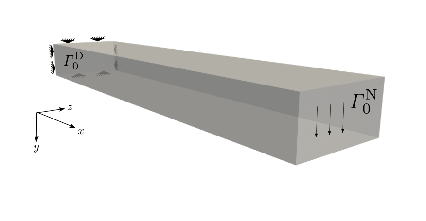

   Cantilever, problem setup.

[fig:cantilever_setup]

Study the setup shown in fig.
`[fig:cantilever_setup] <#fig:cantilever_setup>`__ and the comments in
the input file ``solid_cantilever.py`` Run the simulation, either in one
of the provided Docker containers or using your own FEniCSx/Ambit
installation, using the command

::

   mpiexec -n 1 python3 solid_cantilever.py

It is fully sufficient to use one core (``mpiexec -n 1``) for the
presented setup.

Open the results file ``results_solid_cantilever_displacement.xdmf`` in
Paraview, and visualize the deformation over time.

Figure `[fig:cantilever_results] <#fig:cantilever_results>`__ shows the
displacement magnitude at the end of the simulation.

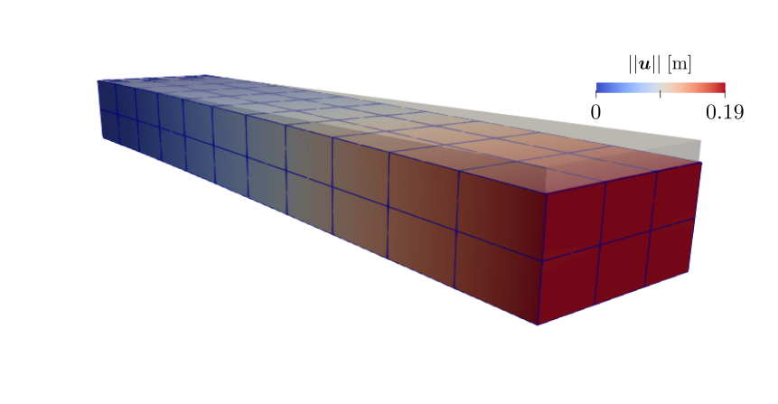

   Cantilever, tip deformation. Color shows displacement magnitude.

[fig:cantilever_results]

.. _subsec:demos:fluid:

Fluid
-----

| – Physics description given in sec. `3.2 <#subsec:fluid>`__
| – Input files: ``demos/fluid``

2D channel flow
~~~~~~~~~~~~~~~

This example shows how to set up 2D fluid flow in a channel around a
rigid obstacle. Incompressible Navier-Stokes flow is solved using
Taylor-Hood elements (9-node biquadratic quadrilaterals for the
velocity, 4-node bilinear quadrilaterals for the pressure).

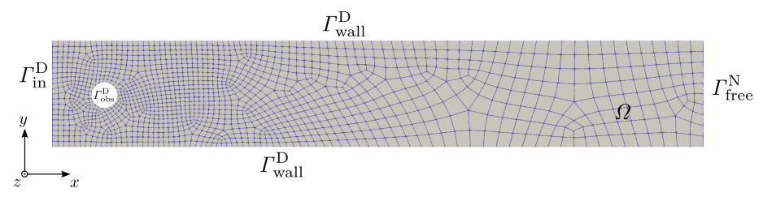

   Channel flow, problem setup.

[fig:channel_setup]

Study the setup and the comments in the input file ``fluid_channel.py``.
Run the simulation, either in one of the provided Docker containers or
using your own FEniCSx/Ambit installation, using the command

::

   mpiexec -n 1 python3 fluid_channel.py

It is fully sufficient to use one core (``mpiexec -n 1``) for the
presented setup.

| Open the results file ``results_fluid_channel_velocity.xdmf`` and
| ``results_fluid_channel_pressure.xdmf`` in Paraview, and visualize the
  velocity as well as the pressure over time.

Fig. `[fig:channel_results] <#fig:channel_results>`__ shows the velocity
magnitude (top) as well as the pressure (bottom part) at the end of the
simulation.

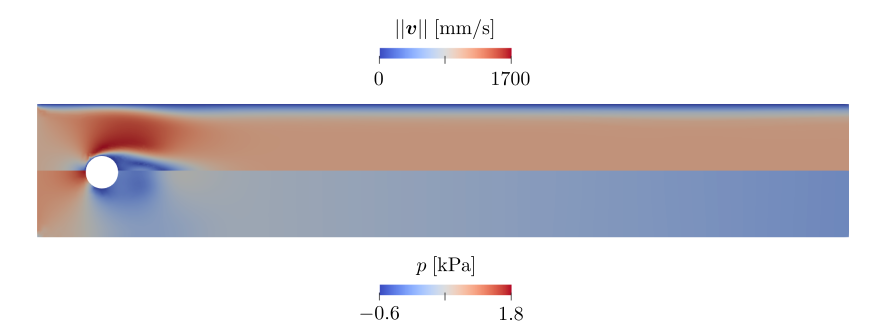

   Velocity magnitude (top part) and pressure (bottom part) at end of
   simulation.

[fig:channel_results]

.. _subsec:demos:flow0d:

0D flow
-------

| – Physics description given in sec. `3.3 <#subsec:flow0d>`__
| – Input files: ``demos/flow0d``

.. _systemic-and-pulmonary-circulation-1:

Systemic and pulmonary circulation
~~~~~~~~~~~~~~~~~~~~~~~~~~~~~~~~~~

This example demonstrates how to simulate a cardiac cycle using a
lumped-parameter (0D) model for the heart chambers and the entire
circulation. Multiple heart beats are run until a periodic state
criterion is met (which compares variable values at the beginning to
those at the end of a cycle, and stops if the relative change is less
than a specified value, here :literal:`\`eps_periodic'` in the
``TIME_PARAMS`` dictionary). The problem is set up such that periodicity
is reached after 5 heart cycles.

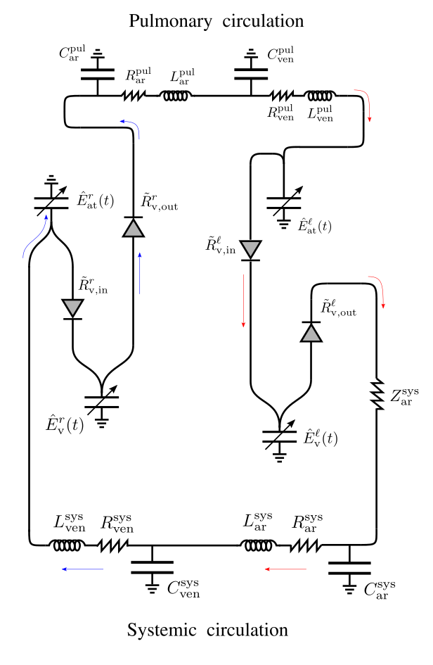

   0D heart, systemic and pulmonary circulation, problem setup.

[fig:syspul_setup]

Study the setup in fig. `[fig:syspul_setup] <#fig:syspul_setup>`__ and
the comments in the input file ``flow0d_heart_cycle.py``. Run the
simulation, either in one of the provided Docker containers or using
your own FEniCSx/Ambit installation, using the command

::

   python3 flow0d_heart_cycle.py

For postprocessing of the time courses of pressures, volumes, and fluxes
of the 0D model, either use your own tools to plot the text output files
(first column is time, second is the respective quantity), or make sure
to have Gnuplot (and TeX) installed and navigate to the output folder
(``tmp/``) in order to execute the script ``flow0d_plot.py`` (which lies
in ``ambit/src/ambit_fe/postprocess/``):

::

   flow0d_plot.py -s flow0d_heart_cycle -n 100

| A folder ``plot_flow0d_heart_cycle`` is created inside ``tmp/``. Look
  at the results of pressures (:math:`p`), volumes (:math:`V`), and
  fluxes (:math:`q`, :math:`Q`) over time. Subscripts ``v``, ``at``,
  ``ar``, ``ven`` refer to ‘ventricular’, ‘atrial’, ‘arterial’, and
  ‘venous’, respectively. Superscripts ``l``, ``r``, ``sys``, ``pul``
  refer to ‘left’, ‘right’, ‘systemic’, and ‘pulmonary’, respectively.
  Try to understand the time courses of the respective pressures, as
  well as the plots of ventricular pressure over volume. Check that the
  overall system volume is constant and around 4-5 liters.
| The solution is depicted in fig.
  `[fig:syspul_results] <#fig:syspul_results>`__, showing the time
  course of volumes and pressures of the circulatory system.

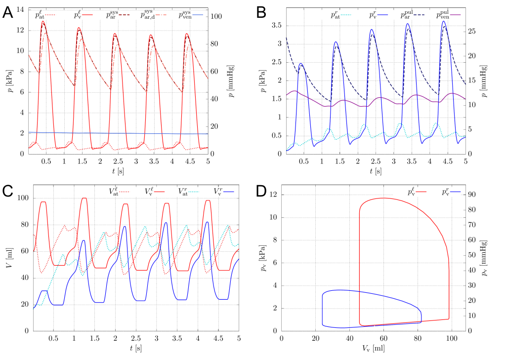

   A. Left heart and systemic pressures over time. B. Right heart and
   pulmonary pressures over time. C. Left and right ventricular and
   atrial volumes over time. D. Left and right ventricular
   pressure-volume relationships of periodic (5th) cycle.

[fig:syspul_results]

.. _subsec:demos:solid_flow0d:

Solid + 0D flow
---------------

| – Physics description given in sec.
  `3.4.1 <#subsubsec:solid_flow0d>`__
| – Input files: ``demos/solid_flow0d``

3D heart, coupled to systemic and pulmonary circulation
~~~~~~~~~~~~~~~~~~~~~~~~~~~~~~~~~~~~~~~~~~~~~~~~~~~~~~~

| This example demonstrates how to set up and simulate a two-chamber
  (left and right ventricular) solid mechanics heart model coupled to a
  closed-loop 0D circulatory system. A full dynamic heart cycle of
  duration 1 s is simulated, where the active contraction is modeled by
  a prescribed active stress approach. Passive material behavior of the
  heart muscle is governed by the Holzapfel-Ogden anisotropic strain
  energy function :cite:p:`holzapfel2009` and a strain
  rate-dependent viscous model :cite:p:`chapelle2012`. We
  start the simulation with "prestressing" using the MULF method
  :cite:p:`gee2010,schein2021`, which allows to imprint loads
  without changing the geometry, where the solid is loaded to the
  initial left and right ventricular pressures. Thereafter, we kickstart
  the dynamic simulation with passive ventricular filling by the systole
  of the atria (0D chamber models). Ventricular systole happens in
  :math:`t \in [0.2\;\mathrm{s}, 0.53\;\mathrm{s}]`, hence lasting a
  third of the whole cycle time. After systole, the heart relaxes and
  eventually fills to about the same pressure as it has been initialized
  to.
| NOTE: For demonstrative purposes, a fairly coarse finite element
  discretization is chosen here, which by no means yields a spatially
  converged solution and which may be prone to locking phenomena. The
  user may increse the parameter :literal:`\`order_disp'` in the
  ``FEM_PARAMS`` section from ``1`` to ``2`` (and increase
  :literal:`\`quad_degree'` to ``6``) such that quadratic finite element
  ansatz functions (instead of linear ones) are used. While this will
  increase accuracy and mitigate locking, computation time will
  increase.

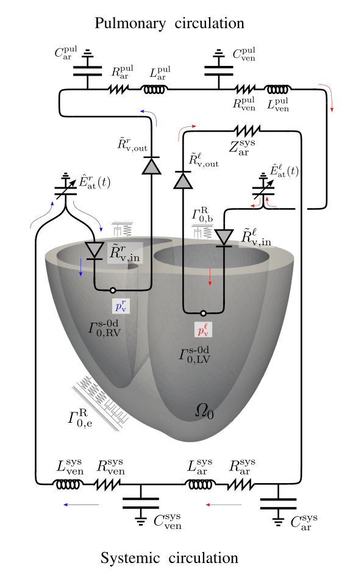

   Generic 3D ventricular heart model coupled to a closed-loop systemic
   and pulmonary circulation model.

[fig:heart_syspul_setup]

Study the setup shown in fig.
`[fig:heart_syspul_setup] <#fig:heart_syspul_setup>`__ and the comments
in the input file ``solid_flow0d_heart_cycle.py``. Run the simulation,
either in one of the provided Docker containers or using your own
FEniCSx/Ambit installation, using the command

::

   mpiexec -n 1 python3 solid_flow0d_heart_cycle.py

It is fully sufficient to use one core (``mpiexec -n 1``) for the
presented setup, while you might want to use more (e.g.,
``mpiexec -n 4``) if you increase :literal:`\`order_disp'` to ``2``.

Open the results file
``results_solid_flow0d_heart_cycle_displacement.xdmf`` in Paraview, and
visualize the deformation over the heart cycle.

For postprocessing of the time courses of pressures, volumes, and fluxes
of the 0D model, either use your own tools to plot the text output files
(first column is time, second is the respective quantity), or make sure
to have Gnuplot (and TeX) installed and navigate to the output folder
(``tmp/``) in order to execute the script ``flow0d_plot.py`` (which lies
in ``ambit/src/ambit_fe/postprocess/``):

::

   flow0d_plot.py -s solid_flow0d_heart_cycle -V0 117e3 93e3 0 0 0

| A folder ``plot_solid_flow0d_heart_cycle`` is created inside ``tmp/``.
  Look at the results of pressures (:math:`p`), volumes (:math:`V`), and
  fluxes (:math:`q`, :math:`Q`) over time. Subscripts ``v``, ``at``,
  ``ar``, ``ven`` refer to ‘ventricular’, ‘atrial’, ‘arterial’, and
  ‘venous’, respectively. Superscripts ``l``, ``r``, ``sys``, ``pul``
  refer to ‘left’, ‘right’, ‘systemic’, and ‘pulmonary’, respectively.
  Try to understand the time courses of the respective pressures, as
  well as the plots of ventricular pressure over volume. Check that the
  overall system volume is constant and around 4-5 liters.
| NOTE: This setup computes only one cardiac cycle, which does not yield
  a periodic state solution (compare e.g. initial and end-cyclic right
  ventricular pressures and volumes, which do not coincide). Change the
  parameter ``number_of_cycles`` from ``1`` to ``10`` and re-run the
  simulation. The simulation will stop when the cycle error (relative
  change in 0D variable quantities from beginning to end of a cycle)
  falls below the value of :literal:`\`eps_periodic'` (set to
  :math:`5 \%`). How many cycles are needed to reach periodicity?
| Figure `[fig:heart_syspul_results] <#fig:heart_syspul_results>`__
  shows a high-fidelity solution using a refined mesh and quadratic
  tetrahedral elements. Compare your solution from the coarser mesh.
  What is the deviation in ventricular volume?

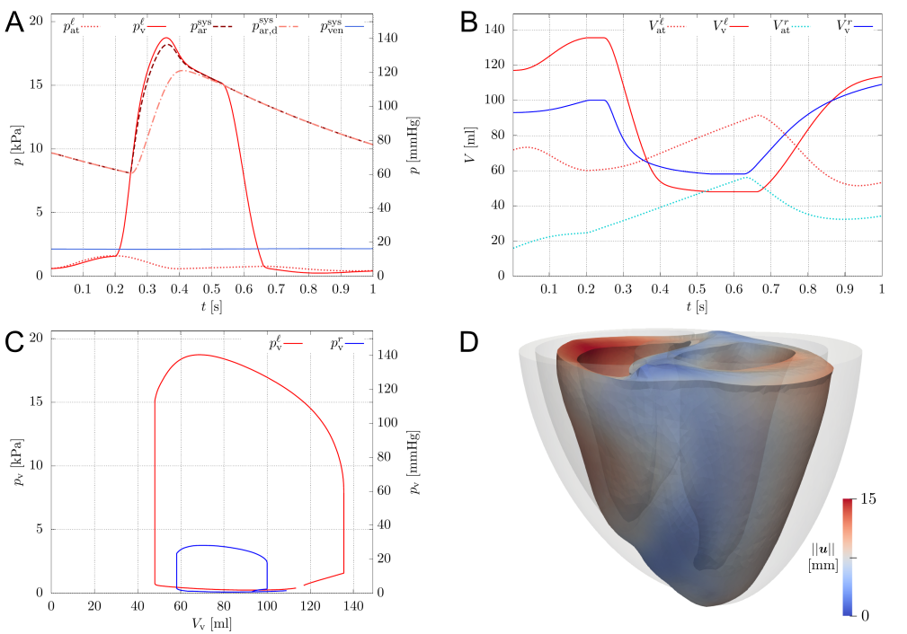

   A. Left heart and systemic pressures over time. B. Left and right
   ventricular and atrial volumes over time. C. Left and right
   ventricular pressure-volume relationships. D. Snapshot of heart
   deformation at end-systole, color indicates displacement magnitude.

[fig:heart_syspul_results]

.. _subsec:demos:fluid_flow0d:

Fluid + 0D flow
---------------

| – Physics description given in sec.
  `3.4.2 <#subsubsec:fluid_flow0d>`__
| – Input files: ``demos/fluid_flow0d``

Blocked pipe flow with 0D model bypass
~~~~~~~~~~~~~~~~~~~~~~~~~~~~~~~~~~~~~~

| **Note:**\ *This demo only runs with the mixed dolfinx branch, which
  is pre-installed in the Ambit devenv Docker container. Pull this
  container and install Ambit in there according to the instructions in
  sec.*\ `2 <#sec:inst>`__\ *.*
| This example demonstrates how to couple 3D fluid flow to a 0D
  lumped-parameter model. Incompressible transient Navier-Stokes flow in
  a pipe with prescribed inflow is solved, with the special constraint
  that an internal boundary (all-time closed valve) separates region 1
  and region 2 of the pipe. This internal Dirichlet condition can only
  be achieved by splitting the pressure space, hence having duplicate
  pressure nodes at the valve plane. Otherwise, fluid would experience
  deceleration towards the valve and unphysical acceleration behind it,
  since the pressure gradient drives fluid flow. To achieve this, the
  mixed Dolfinx branch instead of the main branch is used. It is
  installed inside the Ambit devenv Docker container. In the future,
  this functionality is expected to be merged into the Dolfinx main
  branch (at least it was announced...).
| This example demonstrates how the closed valve can be bypassed by a 0D
  flow model that links the 3D fluid out-flow of one region to the
  in-flow of the other region. The 0D model consists of two Windkessel
  models in series, each having compliance, resistance, and inertance
  elements.

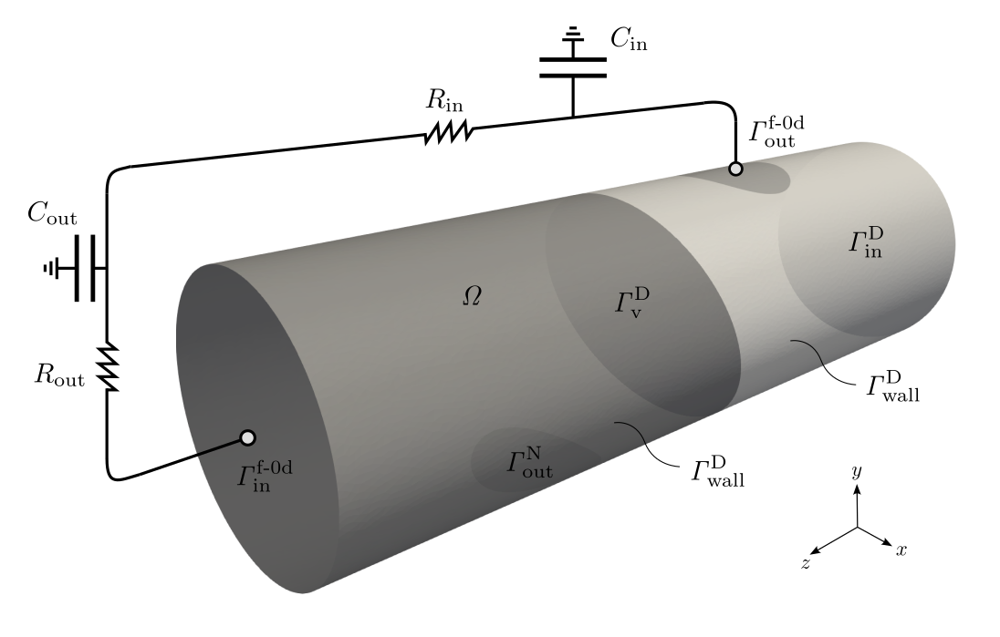

   Blocked pipe with 0D model bypass, simulation setup.

[fig:pipe_0d_setup]

Study the setup shown in fig.
`[fig:pipe_0d_setup] <#fig:pipe_0d_setup>`__ and the comments in the
input file ``fluid_flow0d_pipe.py``. Run the simulation, either in one
of the provided Docker containers or using your own FEniCSx/Ambit
installation, using the command

::

   mpiexec -n 1 python3 fluid_flow0d_pipe.py

It is fully sufficient to use one core (``mpiexec -n 1``) for the
presented setup.

Open the results file ``results_fluid_flow0d_pipe_velocity.xdmf`` in
Paraview, and visualize the velocity over time.

| Think of which parameter(s) of the 0D model to tweak in order to
  achieve a) little to no fluid in-flow (into
  :math:`\mathit{\Gamma}_{\mathrm{in}}^{\mathrm{f\text{-}0d}}`), b)
  almost the same flow across
  :math:`\mathit{\Gamma}_{\mathrm{out}}^{\mathrm{f\text{-}0d}}` and
  :math:`\mathit{\Gamma}_{\mathrm{in}}^{\mathrm{f\text{-}0d}}`. Think of
  where the flow is going to in case of a).
| Figure shows the velocity streamlines and magnitude at the end of the
  simulation.

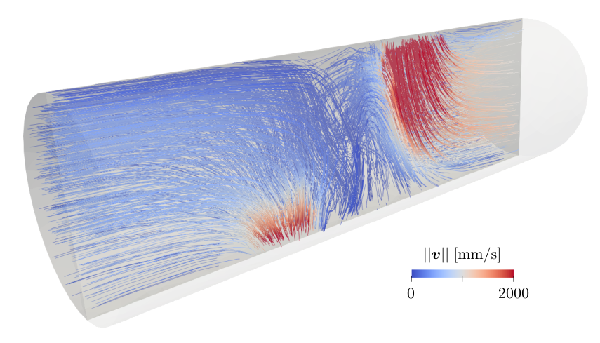

   Streamlines of velocity at end of simulation, color indicates velcity
   magnitude.

[fig:pipe_0d_results]

.. _subsec:demos:fsi:

FSI
---

| – Physics description given in sec. `3.4.4 <#subsubsec:fsi>`__
| – Input files: ``demos/fsi``
| **Note:**\ *FSI only runs with the mixed dolfinx branch, which is
  pre-installed in the Ambit devenv Docker container. Pull this
  container and install Ambit in there according to the instructions in
  sec.*\ `2 <#sec:inst>`__\ *.*

Channel flow around elastic flag
~~~~~~~~~~~~~~~~~~~~~~~~~~~~~~~~

| Incompressible fluid flow in a 2D channel around an elastic flag is
  studied. The setup corresponds to the well-known Turek benchmark
  :cite:p:`turek2006`. A prescribed inflow velocity with
  parabolic inflow profile is used:
| 

  .. math::

     \begin{aligned}
         \boldsymbol{v}_{\text{f}}= \bar{v}(t,y) \boldsymbol{e}_{y}
         \quad &  
         \text{on}\; \mathit{\Gamma}_{t,\mathrm{in}}^{D,\text{f}} \times [0,T],
         \label{eq:flag_dbc_in}
     \end{aligned}

  with

  .. math::

     \begin{aligned}
         \bar{v}(t,y) = \begin{cases} 1.5 \,\bar{U}\, \frac{y(H-y)}{\left(\frac{H}{2}\right)^2} \frac{1-\cos\left(\frac{\pi}{2}t\right)}{2}, & \text{if} \; t < 2, \\ 1.5 \,\bar{U}\, \frac{y(H-y)}{\left(\frac{H}{2}\right)^2}, & \text{else}, \end{cases}
         \label{eq:flag_dbcs_func}
     \end{aligned}

with :math:`\bar{U}=10^{3}\;\mathrm{mm}/\mathrm{s}`.

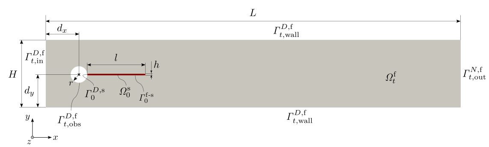

   Channel flow around an elastic flag :cite:p:`turek2006`,
   problem setup.

[fig:channel_flag_setup]

======================== ========================
======================== ========================
======================== ==========================
==========================
:math:`L\;[\mathrm{mm}]` :math:`H\;[\mathrm{mm}]` :math:`r\;[\mathrm{mm}]` :math:`l\;[\mathrm{mm}]` :math:`h\;[\mathrm{mm}]` :math:`d_x\;[\mathrm{mm}]` :math:`d_y\;[\mathrm{mm}]`
2500                     410                      50                       350                      20                       200                        200
======================== ========================
======================== ========================
======================== ==========================
==========================

==== === == === == === ===
L    H   r  l   h  dx  dy
2500 410 50 350 20 200 200
==== === == === == === ===

| Both solid and fluid are discretized with quadrilateral
  :math:`\mathbb{Q}^2`-:math:`\mathbb{Q}^1` Taylor-Hood finite elements,
  hence no stabilization for the fluid problem is needed.
| Study the setup shown in fig.
  `[fig:channel_flag_setup] <#fig:channel_flag_setup>`__ together with
  the parameters in tab.
  `[tab:params_geo_turek] <#tab:params_geo_turek>`__ and the comments in
  the input file ``fsi_channel_flag.py``. Run the simulation, either in
  one of the provided Docker containers or using your own FEniCSx/Ambit
  installation, using the command

::

   mpiexec -n 1 python3 fsi_channel_flag.py

| If your system allows, use more than one core (e.g. ``mpiexec -n 4``)
  in order to speed up the simulation a bit.
| The physics of the problem are strongly time-dependent, and a
  (near-)periodic oscillation of the flag only occurs after
  :math:`t\approx 30\;\mathrm{s}`. Run the problem to the end
  (:math:`t = 35\;\mathrm{s}`), be patient, and monitor the flag tip
  displacement over time. What is the maximum deflection? Figure
  `[fig:channel_flag_results] <#fig:channel_flag_results>`__ depicts the
  velocity at three instances in time towards the end of the simulation.

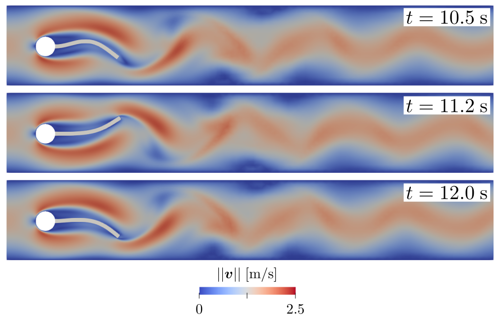

   Streamlines of velocity at three instances in time
   (:math:`t=30\;\mathrm{s}`, :math:`t=32.5\;\mathrm{s}`, and
   :math:`t=35\;\mathrm{s}`) towards end of simulation, color indicates
   velcity magnitude.

[fig:channel_flag_results]
 
.. bibliography::
